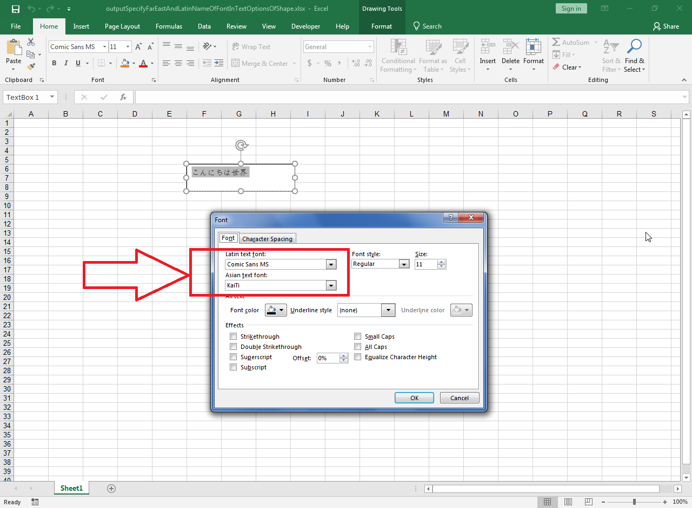

---  
title: Specify the Far East and Latin Name of the Font in Text Options of Shape with Node.js via C++  
linktitle: Specify the Far East and Latin Name of the Font in Text Options of Shape  
type: docs  
weight: 1600  
url: /nodejs-cpp/specify-the-far-east-and-latin-name-of-the-font-in-text-options-of-shape/  
description: Learn how to specify Far East and Latin font names in text options of shapes using Aspose.Cells for Node.js via C++.  
ai_search_scope: cells_nodejscpp
ai_search_endpoint: "https://docsearch.api.aspose.cloud/ask"
---  

## **Possible Usage Scenarios**  

Sometimes you want to display text in a Far East language font, e.g., Japanese, Chinese, Thai, etc. Aspose.Cells for Node.js via C++ provides [**TextOptions.getFarEastName()**](https://reference.aspose.com/cells/nodejs-cpp/textoptions/#getFarEastName--) property that can be used to specify the font name for Far East languages. Besides, you can also specify the Latin font name using [**TextOptions.getLatinName()**](https://reference.aspose.com/cells/nodejs-cpp/textoptions/#getLatinName--) property.  

## **Specify the Far East and Latin Name of the Font in Text Options of Shape**  

The following sample code creates a text box and adds some Japanese text inside it. It then specifies the Latin and Far East font names of the text and saves the workbook as the output Excel file ([output Excel file](67338274.xlsx)). The following screenshot shows the Latin and Far East font names of the output text box in Microsoft Excel.  

  

## **Sample Code**  

```javascript
const path = require("path");
const AsposeCells = require("aspose.cells.node");

// The path to the documents directory.
const dataDir = path.join(__dirname, "data");
const filePath = path.join(dataDir, "sample.xlsx");
// Create empty workbook.
const wb = new AsposeCells.Workbook();

// Access first worksheet.
const ws = wb.getWorksheets().get(0);

// Add a textbox inside the worksheet.
const idx = ws.getTextBoxes().add(5, 5, 50, 200);
const tb = ws.getTextBoxes().get(idx);

// Set the text of the textbox.
tb.setText("こんにちは世界");

// Specify the Far East and Latin name of the font.
tb.getTextOptions().setLatinName("Comic Sans MS");
tb.getTextOptions().setFarEastName("KaiTi");

// Save the output Excel file.
wb.save("outputSpecifyFarEastAndLatinNameOfFontInTextOptionsOfShape.xlsx", AsposeCells.SaveFormat.Xlsx);
```  


