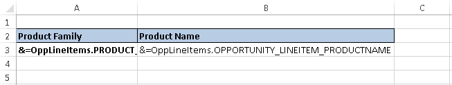

---  
title: Getting Notifications while Merging Data with Smart Markers using Node.js via C++  
linktitle: Getting Notifications while Merging Data with Smart Markers  
type: docs  
weight: 20  
url: /nodejs-cpp/getting-notifications-while-merging-data-with-smart-markers/  
---  

{}  

Aspose.Cells APIs provide the [WorkbookDesigner](https://reference.aspose.com/cells/nodejs-cpp/workbookdesigner) class to [work with Smart Markers](https://docs.aspose.com/cells/nodejs-cpp/smart-markers/) where the formatting & formulas are placed in the [designer spreadsheets](/cells/nodejs-cpp/what-is-a-designer-spreadsheet/) and then processed with [WorkbookDesigner](https://reference.aspose.com/cells/nodejs-cpp/workbookdesigner) class to fill up the data according to specified Smart Markers. Sometimes, it may be required to get the notifications about the cell reference or the particular Smart Marker being processed. This can be achieved using the [WorkbookDesigner.CallBack](https://reference.aspose.com/cells/nodejs-cpp/workbookdesigner/#callback) property and [ISmartMarkerCallBack](https://reference.aspose.com/cells/nodejs-cpp/ismartmarkercallback) interface exposed with the release of Aspose.Cells for Node.js via C++ 8.6.2.  

{}  

The following piece of code demonstrates the usage of [ISmartMarkerCallBack](https://reference.aspose.com/cells/nodejs-cpp/ismartmarkercallback) interface to define a new class that handles the call back for [WorkbookDesigner.Process](https://reference.aspose.com/cells/nodejs-cpp/workbookdesigner/#process) method.  

```javascript
const AsposeCells = require("aspose.cells.node");

class SmartMarkerCallBack {
    constructor(workbook) {
        this.workbook = workbook;
    }

    process(sheetIndex, rowIndex, colIndex, tableName, columnName) {
        console.log(`Processing Cell: ${this.workbook.getWorksheets().get(sheetIndex).getName()}!${AsposeCells.CellsHelper.cellIndexToName(rowIndex, colIndex)}`);
        console.log(`Processing Marker: ${tableName}.${columnName}`);
    }
}
```  

Rest of the process includes loading designer spreadsheet containing the Smart Markers with [WorkbookDesigner](https://reference.aspose.com/cells/nodejs-cpp/workbookdesigner) and process it by setting the data source. In order to keep the example simple, we have used a predefined designer spreadsheet containing only two Smart Markers as shown in the below snapshot where the data source is being created dynamically to merge the data according to the specified Smart Markers.  

||  
| :- |  
```javascript
const AsposeCells = require("aspose.cells.node");
const path = require("path");

// The path to the documents directory.
const dataDir = path.join(__dirname, "data");
const outputPath = path.join(dataDir, "Output.out.xlsx");

// Creating a DataTable that will serve as data source for designer spreadsheet
const table = new AsposeCells.DataTable("OppLineItems");
table.getColumns().add("PRODUCT_FAMILY");
table.getColumns().add("OPPORTUNITY_LINEITEM_PRODUCTNAME");
table.getRows().add(new Object[] { "MMM", "P1" });
table.getRows().add(new Object[] { "MMM", "P2" });
table.getRows().add(new Object[] { "DDD", "P1" });
table.getRows().add(new Object[] { "DDD", "P2" });
table.getRows().add(new Object[] { "AAA", "P1" });

// Loading the designer spreadsheet in an instance of Workbook
const workbook = new AsposeCells.Workbook(path.join(dataDir, "source.xlsx"));

// Loading the instance of Workbook in an instance of WorkbookDesigner
const designer = new AsposeCells.WorkbookDesigner(workbook);

// Set the WorkbookDesigner.CallBack property to an instance of newly created class
designer.setCallBack(new SmartMarkerCallBack(workbook));

// Set the data source 
designer.setDataSource(table);

// Process the Smart Markers in the designer spreadsheet
designer.process(false);

// Save the result
workbook.save(outputPath);
```  
  