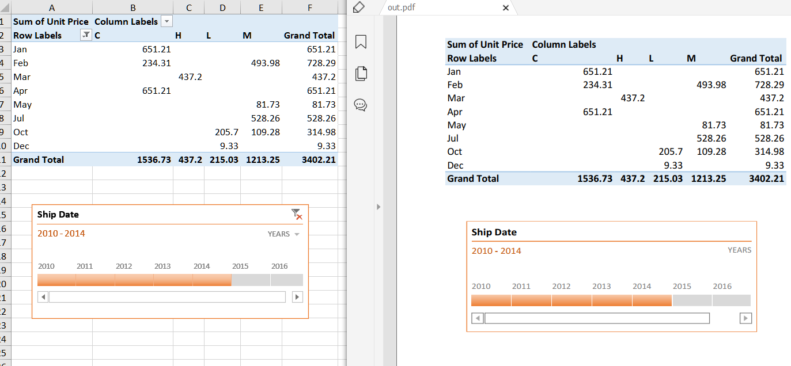

---  
title: Draw Timeline while rendering Excel to PDF with Node.js via C++  
linktitle: Draw Timeline while rendering Excel to PDF  
type: docs  
weight: 60  
url: /nodejs-cpp/draw-timeline-while-rendering-excel-to-pdf/  
description: Manage timelines of Excel files with Aspose.Cells for Node.js via C++.  
keywords: Rendering timeline to pdf without office 2013, office 2016, office 2019 and office 365 Node.js via C++  
---  
  
## **Draw Timeline while rendering Excel to PDF**  
If you have an Excel file which has a timeline applied to it and you want to export the Excel to PDF with the timeline settings, Aspose.Cells for Node.js via C++ now supports this by default. You simply export the Excel file with a timeline to PDF, and the generated PDF will show the timeline applied.  
  
The following sample code loads the [sample Excel file](input.xlsx) that contains an existing timeline. It then saves the workbook as [output PDF file](out.pdf). The following screenshot compares the source Excel file and the generated PDF file.  
  
  
  
## **Sample Code**  
```javascript
const path = require("path");
const AsposeCells = require("aspose.cells.node");

// The path to the documents directory.
const dataDir = path.join(__dirname, "data");
const filePath = path.join(dataDir, "input.xlsx");
// Load sample Excel file
const workbook = new AsposeCells.Workbook(filePath);
// Save file to pdf
workbook.save("out.pdf", AsposeCells.SaveFormat.Pdf);
```  
  