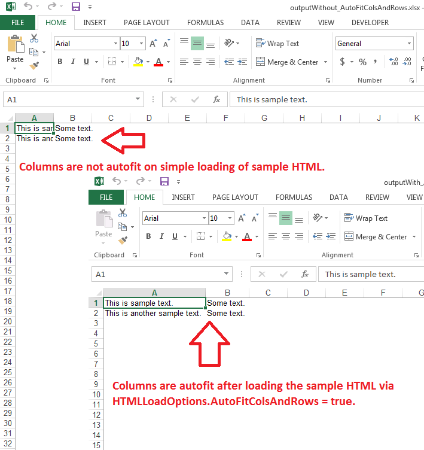

## **Possible Usage Scenarios**

You can autofit columns and rows while loading your HTML file inside the Workbook object. Please set the [**HtmlLoadOptions.getAutoFitColsAndRows()**](https://reference.aspose.com/cells/nodejs-cpp/htmlloadoptions/#getAutoFitColsAndRows--) property to **true** for this purpose.

## **AutoFit Columns and Rows while loading HTML in Workbook**

The following sample code first loads the sample HTML into Workbook without any load options and saves it in XLSX format. It then again loads the sample HTML into Workbook but this time, it loads the HTML after setting the [**HtmlLoadOptions.getAutoFitColsAndRows()**](https://reference.aspose.com/cells/nodejs-cpp/htmlloadoptions/#getAutoFitColsAndRows--) property to **true** and saves it in XLSX format. Please download both the output excel files i.e. [Output Excel File Without AutoFitColsAndRows](outputWithout_AutoFitColsAndRows.xlsx) and [Output Excel File With AutoFitColsAndRows](outputWith_AutoFitColsAndRows.xlsx). The following screenshot shows the effect of [**HtmlLoadOptions.getAutoFitColsAndRows()**](https://reference.aspose.com/cells/nodejs-cpp/htmlloadoptions/#getAutoFitColsAndRows--) property on both output excel files.



## **Sample Code**

```javascript
const path = require("path");
const AsposeCells = require("aspose.cells.node");

// The path to the documents directory.
const dataDir = path.join(__dirname, "data");

// Sample HTML.
const sampleHtml = "<html><body><table><tr><td>This is sample text.</td><td>Some text.</td></tr><tr><td>This is another sample text.</td><td>Some text.</td></tr></table></body></html>";

// Load HTML string into memory stream.
const ms = Uint8Array.from(sampleHtml, c => c.charCodeAt(0));

// Load memory stream into workbook.
let wb = new AsposeCells.Workbook(ms);

// Save the workbook in xlsx format.
wb.save(path.join(dataDir, "outputWithout_AutoFitColsAndRows.xlsx"));

// Specify the HTMLLoadOptions and set AutoFitColsAndRows = true.
const opts = new AsposeCells.HtmlLoadOptions();
opts.setAutoFitColsAndRows(true);

// Load memory stream into workbook with the above HTMLLoadOptions.
wb = new AsposeCells.Workbook(ms, opts);

// Save the workbook in xlsx format.
wb.save(path.join(dataDir, "outputWith_AutoFitColsAndRows.xlsx"));
```

