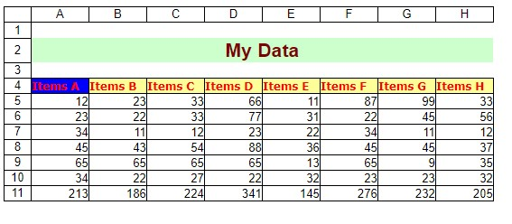

## **Convert Excel to HTML with headings**

Aspose.Cells provides the option to export headings while converting Excel to HTML. For this, you may set the [**HtmlSaveOptions.exportHeadings**](https://reference.aspose.com/cells/nodejs-cpp/htmlsaveoptions/#exportHeadings-boolean-) property to **true**. The default value of [**HtmlSaveOptions.exportHeadings**](https://reference.aspose.com/cells/nodejs-cpp/htmlsaveoptions/#exportHeadings-boolean-) property is **false**. The following image shows the output file generated by the following code.



## **Sample Code**

```javascript
const path = require("path");
const AsposeCells = require("aspose.cells.node");

// Load sample source file
const sourceDir = path.join(__dirname, "data");
const workbook = new AsposeCells.Workbook(path.join(sourceDir, "Book1.xlsx"));

const options = new AsposeCells.HtmlSaveOptions();
options.setExportRowColumnHeadings(true);

// Save the workbook
workbook.save(path.join(__dirname, "PrintHeadings_out.html"), options);
```