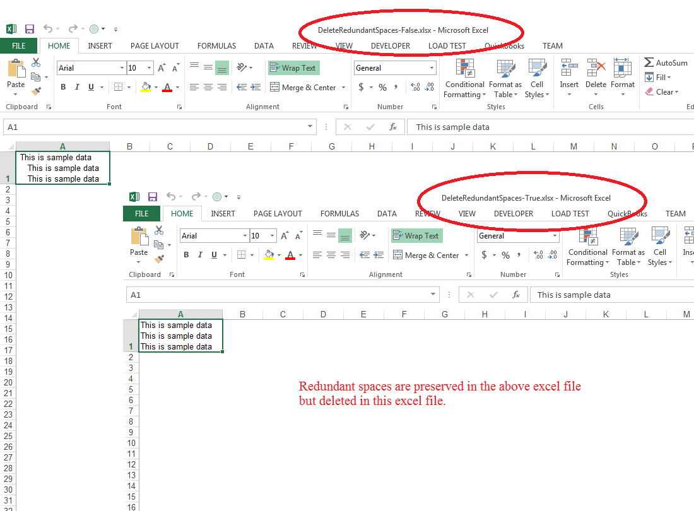

{}

Please use [**HtmlLoadOptions.getDeleteRedundantSpaces()**](https://reference.aspose.com/cells/nodejs-cpp/htmlloadoptions/#getDeleteRedundantSpaces--) property and set it **to true** to delete all the redundant spaces that appear after the line‑break tag. By default, this property is **false**, and redundant spaces are preserved in the output Excel files.

{}

## Effect of setting the HtmlLoadOptions.deleteRedundantSpaces property to false and true

The following screenshot shows the effect of setting this property to **false** and **true**.



## Delete redundant spaces after line break while importing HTML

### Programming Sample

The following sample code shows the usage of the [**HtmlLoadOptions.getDeleteRedundantSpaces()**](https://reference.aspose.com/cells/nodejs-cpp/htmlloadoptions/#getDeleteRedundantSpaces--) property. Please set it **to true** or **false** to get the output as shown in the above screenshot.

```javascript
const AsposeCells = require("aspose.cells.node");
const path = require("path");

// Sample HTML containing redundant spaces after <br> tag
const html = "<html> <body> <table> <tr> <td> <br>    This is sample data <br>    This is sample data<br>    This is sample data</td> </tr> </table> </body> </html>";

// Convert HTML to byte array
const byteArray = Buffer.from(html, 'utf-8');

// Set HTML load options and keep precision true
const loadOptions = new AsposeCells.HtmlLoadOptions(AsposeCells.LoadFormat.Html);
loadOptions.setDeleteRedundantSpaces(true);

// Convert byte array into stream
const stream = Uint8Array.from(byteArray);

// Create workbook from stream with HTML load options
const workbook = new AsposeCells.Workbook(stream, loadOptions);

// Access first worksheet
const sheet = workbook.getWorksheets().get(0);

// Auto‑fit the sheet columns
sheet.autoFitColumns();

// Save the workbook
const outputDir = path.join(__dirname, "output");
workbook.save(path.join(outputDir, "outputDeleteRedundantSpacesWhileImportingFromHtml.xlsx"), AsposeCells.SaveFormat.Xlsx);
```

