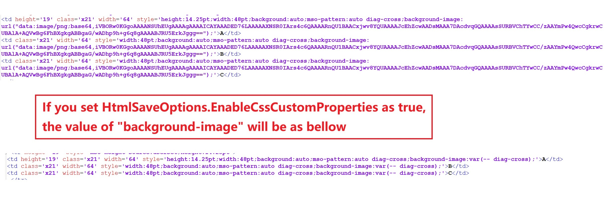

## **Possible Usage Scenarios**

When you save your Excel file to HTML, for the scenario that there are multiple occurrences for one base64 image, with custom property the image data only needs to be saved once so the performance of the resultant HTML can be improved. Please use [**HtmlSaveOptions.getEnableCssCustomProperties()**](https://reference.aspose.com/cells/nodejs-cpp/htmlsaveoptions/#getEnableCssCustomProperties--) property and set it **true** while saving to HTML.
 
 

## **Enable CSS Custom Properties while saving to HTML**

The following sample code shows the usage of [**HtmlSaveOptions.getEnableCssCustomProperties()**](https://reference.aspose.com/cells/nodejs-cpp/htmlsaveoptions/#getEnableCssCustomProperties--) property. The screenshot shows the effect of this property when it is not set to **true**. Please download the [sample Excel file](50528260.xlsx) used in this code and the [output HTML](50528261.zip) generated by it for reference.


## **Sample Code**

```javascript
const path = require("path");
const AsposeCells = require("aspose.cells.node");

// The path to the documents directory.
const dataDir = path.join(__dirname, "data");
// Load sample workbook
const workbook = new AsposeCells.Workbook(path.join(dataDir, "sampleEnableCssCustomProperties.xlsx"));

const opts = new AsposeCells.HtmlSaveOptions();
opts.setExportImagesAsBase64(true);

// Enable EnableCssCustomProperties
opts.setEnableCssCustomProperties(true);

// Save the workbook in HTML
workbook.save(path.join(dataDir, "outputEnableCssCustomProperties.html"), opts);
```

