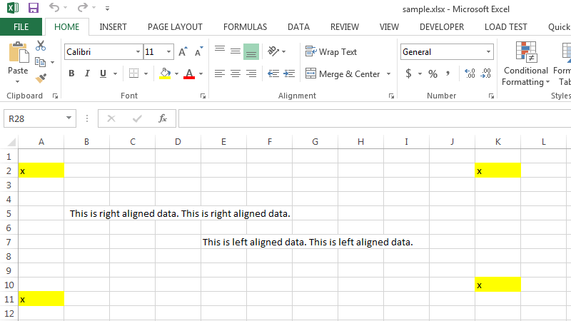
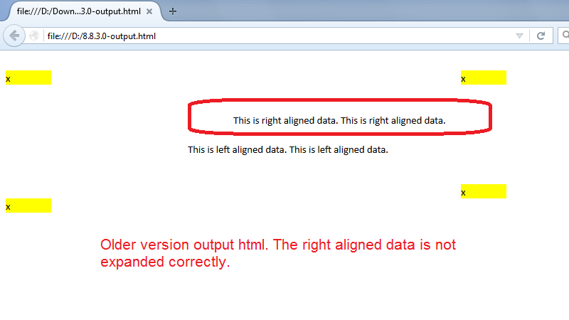

---  
title: Expanding text from right to left while exporting Excel file to HTML with Node.js via C++  
linktitle: Expanding text from right to left while exporting Excel file to HTML  
type: docs  
weight: 60  
url: /nodejs-cpp/expanding-text-from-right-to-left-while-exporting-excel-file-to/  
---  
  
{}  

Aspose.Cells now supports expanding text from right to left while exporting Excel file to HTML. This feature has been implemented since the v8.9.0.0. Now if your source excel file contains any text which expands from right to left, then Aspose.Cells will export it to HTML correctly.  

{}  
## **Expanding text from right to left while exporting Excel file to HTML**  
The following sample code converts the [sample excel file](5115502.xlsx) into HTML. This screenshot shows how the sample excel looks like in Microsoft Excel 2013.  
  
  
  
This screenshot shows the [output HTML generated with older version](5115509).  
  
  
  
This screenshot shows the [output HTML generated with newer version](5115508).  
  
  
  
As you can see in the screenshots, the newer version expands the right-aligned text to left correctly just like Microsoft Excel.  
  
  
```javascript
const path = require("path");
const AsposeCells = require("aspose.cells.node");

// The path to the documents directory.
const dataDir = path.join(__dirname, "data");
const filePath = path.join(dataDir, "sample.xlsx");
// Load source excel file inside the workbook object
const wb = new AsposeCells.Workbook(filePath);

// Save workbook in html format
wb.save(path.join(dataDir, `ExpandTextFromRightToLeft_out_${AsposeCells.CellsHelper.getVersion()}.html`), AsposeCells.SaveFormat.Html);
```  
  