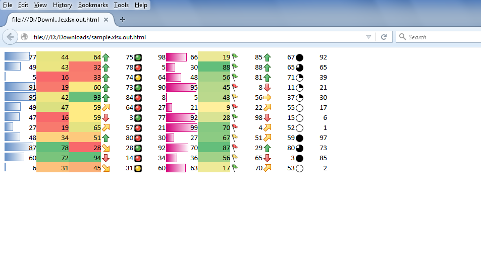

---  
title: Export DataBar, ColorScale and IconSet Conditional Formatting while Converting Excel to HTML with Node.js via C++  
linktitle: Export DataBar, ColorScale and IconSet Conditional Formatting while Converting Excel to HTML  
type: docs  
weight: 30  
url: /nodejs-cpp/export-databar-colorscale-and-iconset-conditional-formatting-while-excel-to-html-conversion/  
ai_search_scope: cells_nodejscpp
ai_search_endpoint: "https://docsearch.api.aspose.cloud/ask"
---  

{} 

You can export DataBar, ColorScale and IconSet Conditional Formatting while converting your Excel file into HTML. This feature is partially supported by Microsoft Excel but Aspose.Cells for Node.js via C++ supports it fully.

{}  

## **Export DataBar, ColorScale and IconSet Conditional Formatting while Converting Excel to HTML**  
The following screenshot shows the [sample Excel file](5115558.xlsx) with DataBar, ColorScale and IconSet Conditional Formatting. You can download the [sample Excel file](5115558.xlsx) from the given link.  

  

The following screenshot shows the Aspose.Cells output HTML file displaying DataBar, ColorScale and IconSet Conditional Formatting. As you can see, it looks exactly like the [sample Excel file](5115558.xlsx).  

  

### **Sample Code**  
The following sample code converts the sample Excel file into HTML, which is a normal [Excel to HTML conversion](/cells/nodejs-cpp/convert-workbook-to-different-formats/#convertworkbooktodifferentformats-convertingexcelworkbooktohtml).  
```javascript
const path = require("path");
const AsposeCells = require("aspose.cells.node");

// The path to the documents directory.
const dataDir = path.join(__dirname, "data");
// Specify the file path
const filePath = path.join(dataDir, "sample.xlsx");

// Load your sample Excel file in a workbook object
const wb = new AsposeCells.Workbook(filePath);

// Save it in HTML format
wb.save(path.join(dataDir, "ConvertingToHTMLFiles_out.html"), AsposeCells.SaveFormat.Html);
```  


