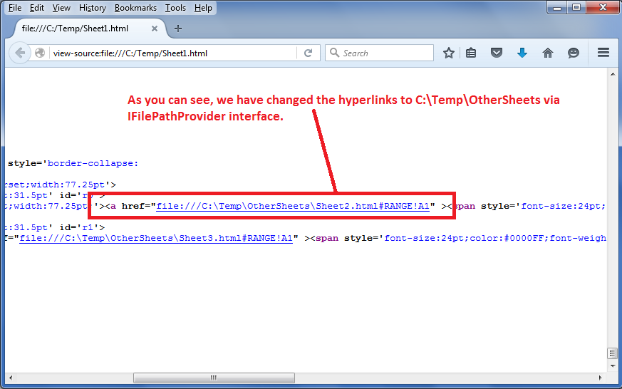

## **Possible Usage Scenarios**
Suppose you have an Excel file with multiple sheets and you want to export each sheet to an individual HTML file. If any of your sheets have links to other sheets, then those links will be broken in the exported HTML. To deal with this problem, Aspose.Cells for Node.js via C++ provides the [IFilePathProvider](https://reference.aspose.com/cells/nodejs-cpp/ifilepathprovider) interface, which you can implement to fix the broken links.

## **Provide exported worksheet HTML file path via IFilePathProvider interface**
Please download the [sample excel file](5115213.zip) used in the following code and its exported HTML files. All these files are inside the Temp directory. You should extract it on the C: drive. Then, it will become the C:\Temp directory. Then you will open the Sheet1.html file in the browser and click the two links inside it. These links refer to these two exported HTML worksheets which are inside the C:\Temp\OtherSheets directory.


 file:///C:/Temp/OtherSheets/Sheet2.html#RANGE!A1

file:///C:/Temp/OtherSheets/Sheet3.html#RANGE!A1


The following screenshot shows how the C:\Temp\Sheet1.html and its links look like


The following screenshot shows the HTML source. As you can see, the links are now referring to C:\Temp\OtherSheets directory. This was achieved using the [IFilePathProvider](https://reference.aspose.com/cells/nodejs-cpp/ifilepathprovider) interface.



## **Sample Code**
Please note the C:\Temp directory is just for illustration purposes. You can use any directory of your choice and place the [sample excel file](5115211.xlsx) inside there and execute the provided sample code. It will then create an OtherSheets sub-directory inside your directory and export the second and third worksheets HTML inside it. Please change the dirPath variable inside the provided code and refer it to the directory of your choice before execution.

{} 

The sample code will only work when you set the Aspose.Cells license. If you try to run the code without setting the license, it will go into an infinite loop. Therefore, we have added a check to print a message and stop execution when the license is not set. You can either purchase a license or request a 30-day temporary license from the Aspose.Purchase team.

{} 

Please note that commenting out these lines inside the code will break the links in Sheet1.html, and Sheet2.html or Sheet3.html will not open up when their links are clicked inside Sheet1.html.

```javascript
const path = require("path");
const AsposeCells = require("aspose.cells.node");
// Implementation of IFilePathProvider interface
class FilePathProvider extends AsposeCells.IFilePathProvider
{
// Constructor
constructor() 
{
super();
}

// Gets the full path of the file by worksheet name when exporting worksheet to html separately.
// So the references among the worksheets could be exported correctly.
getFullName(sheetName) 
{
if (sheetName === "Sheet2")
{
return "file:///" + path.join("OtherSheets", "Sheet2.html");
} 
else if (sheetName === "Sheet3") 
{
return "file:///" + path.join("OtherSheets", "Sheet3.html");
}

return "";
}
}

// The path to the documents directory.
const dataDir = path.join(__dirname, "data");
const filePath = path.join(dataDir, "sample.xlsx");
// Loads the workbook which contains hidden external links
const workbook = new AsposeCells.Workbook(filePath);

// For complete examples and data files, please go to https://github.com/aspose-cells/Aspose.Cells-for-.NET
// If you will comment this line, then hyperlinks will be broken
const options = new AsposeCells.HtmlSaveOptions();
options.setFilePathProvider(new FilePathProvider());
```

Here is the complete sample code which you can execute with the provided [sample excel file](5115211.xlsx).

```javascript
const fs = require("fs");
const path = require("path");
const AsposeCells = require("aspose.cells.node");

// Implementation of IFilePathProvider interface
class FilePathProvider extends AsposeCells.IFilePathProvider
{
// Constructor
constructor() 
{
super();
}

// Gets the full path of the file by worksheet name when exporting worksheet to html separately.
// So the references among the worksheets could be exported correctly.
getFullName(sheetName) 
{
if (sheetName === "Sheet2")
{
return "file:///" + path.join("OtherSheets", "Sheet2.html");
} 
else if (sheetName === "Sheet3") 
{
return "file:///" + path.join("OtherSheets", "Sheet3.html");
}

return "";
}
}

// This is the directory path which contains the sample.xlsx file
const dirPath = path.join(__dirname, "data");

// because Aspose.Cells will always make the warning worksheet as active sheet in Evaluation mode.
//setLicense();

// Check if license is set, otherwise do not proceed
const wb = new AsposeCells.Workbook();
if (!wb.isLicensed()) {
console.log("You must set the license to execute this code successfully.");
} else {
// Test IFilePathProvider interface
testFilePathProvider();
}

function setLicense() {
const licPath = "Aspose.Cells.lic";

const lic = new AsposeCells.License();
lic.setLicense(licPath);

console.log(AsposeCells.CellsHelper.getVersion());
console.debug(AsposeCells.CellsHelper.getVersion());

process.chdir(dirPath);
}

function testFilePathProvider() {
// Create subdirectory for second and third worksheets
const otherSheetsDir = path.join(dirPath, "OtherSheets");
if (!fs.existsSync(otherSheetsDir)) {
fs.mkdirSync(otherSheetsDir);
}

// Load sample workbook from your directory
const wb = new AsposeCells.Workbook(path.join(dirPath, "Sample_filepath.xlsx"));

// Save worksheets to separate html files
// Because of IFilePathProvider, hyperlinks will not be broken.
for (let i = 0; i < wb.getWorksheets().getCount(); i++)
{
// Set the active worksheet to current value of variable i
wb.getWorksheets().setActiveSheetIndex(i);

// Create html save option
const options = new AsposeCells.HtmlSaveOptions();
options.setExportActiveWorksheetOnly(true);
// If you will comment this line, then hyperlinks will be broken
options.setFilePathProvider(new FilePathProvider());
// Sheet actual index which starts from 1 not from 0
const sheetIndex = i + 1;

let filePath = "";

// Save first sheet to same directory and second and third worksheets to subdirectory
if (i === 0) 
{
filePath = path.join(dirPath, "Sheet1.html");
} 
else 
{
filePath = path.join(otherSheetsDir, `Sheet${sheetIndex}_out.html`);
}

// Save the worksheet to html file
wb.save(filePath, options);
}
}
```

