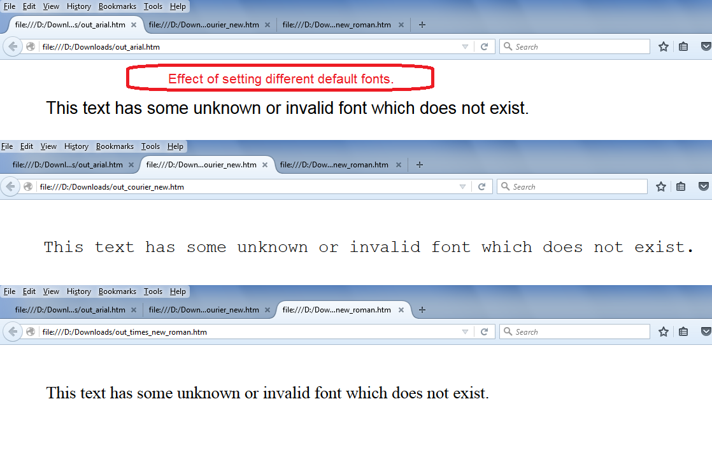

---  
title: Set Default Font while rendering spreadsheet to HTML with Node.js via C++  
linktitle: Set Default Font while rendering spreadsheet to HTML  
type: docs  
weight: 370  
url: /nodejs-cpp/set-default-font-while-rendering-spreadsheet-to/  
---  

{}  
Aspose.Cells allows you to set default font while rendering spreadsheet to HTML. Please use the [**HtmlSaveOptions.DefaultFontName**](https://reference.aspose.com/cells/nodejs-cpp/htmlsaveoptions/properties/defaultfontname) for this purpose. This property is useful when there are some cells in a spreadsheet that have invalid or non-existing fonts. Then those cells will be rendered in a font specified with the [**HtmlSaveOptions.DefaultFontName**](https://reference.aspose.com/cells/nodejs-cpp/htmlsaveoptions/properties/defaultfontname) property.  
{}  

## Set Default Font while rendering spreadsheet to HTML  

The following sample code creates a workbook and adds some text in cell B4 of the first worksheet and sets its font to some unknown/non-existing font. Then it saves the workbook in HTML by setting different default font names like Courier New, Arial, Times New Roman, etc.  

The screenshot shows the effect of setting different default font names via [**HtmlSaveOptions.DefaultFontName**](https://reference.aspose.com/cells/nodejs-cpp/htmlsaveoptions/properties/defaultfontname) property.  

  

The code generates the [output HTML file with Courier New](5115516), the [output HTML with Arial](5115518), and the [output HTML file with Times New Roman](5115517).  

## Sample Code  

```javascript
const path = require("path");
const AsposeCells = require("aspose.cells.node");

// The path to the documents directory.
const dataDir = path.join(__dirname, "data");

// Create workbook object and access first worksheet.
const wb = new AsposeCells.Workbook();
const ws = wb.getWorksheets().get(0);

// Access cell B4 and add some text inside it.
const cell = ws.getCells().get("B4");
cell.putValue("This text has some unknown or invalid font which does not exist.");

// Set the font of cell B4 which is unknown.
const st = cell.getStyle();
st.getFont().setName("UnknownNotExist");
st.getFont().setSize(20);
cell.setStyle(st);

// Now save the workbook in html format and set the default font to Courier New.
const opts = new AsposeCells.HtmlSaveOptions();
opts.setDefaultFontName("Courier New");
wb.save(path.join(dataDir, "out_courier_new_out.htm"), opts);

// Now save the workbook in html format once again but set the default font to Arial.
opts.setDefaultFontName("Arial");
wb.save(path.join(dataDir, "out_arial_out.htm"), opts);

// Now save the workbook in html format once again but set the default font to Times New Roman.
opts.setDefaultFontName("Times New Roman");
wb.save(path.join(dataDir, "times_new_roman_out.htm"), opts);
```  
  