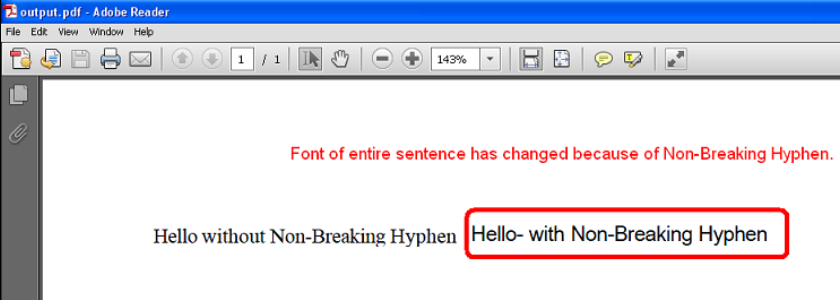

{} 

Some Unicode characters are not displayable by the user-specified font. One such Unicode character is **Non-breaking Hyphen** (U+2011) and its Unicode number is 8209. This character cannot be displayed with **Times New Roman**, but it can be displayed with other fonts like **Arial Unicode MS**.

When such a character occurs inside some word or sentence which is in a specific font like Times New Roman, then Aspose.Cells changes the font of the entire word or sentence to a font which could display this character like Arial Unicode to MS.

However, this is undesirable behavior for some users and they want only that specific character's font to be changed instead of changing the font of the entire word or sentence.

To deal with this problem, Aspose.Cells provides the `PdfSaveOptions.isFontSubstitutionCharGranularity` property which should be set to true so that only the font of specific characters which are not displayable will be changed to a displayable font, while the rest of the word or sentence should remain in the original font.

{} 

## **Example**
The following screenshot compares the two output PDFs generated by the sample code below.

One is generated without setting `PdfSaveOptions.isFontSubstitutionCharGranularity` property and the other was generated after setting the `PdfSaveOptions.isFontSubstitutionCharGranularity` property to true.

As you can see in the first PDF, the font of the entire sentence has changed from Times New Roman to Arial Unicode MS because of the Non-Breaking Hyphen. While in the second PDF, only the font of Non-Breaking Hyphen has changed.

|**First Pdf File**|
| :- |
||


|**Second Pdf File**|
| :- |
||
### **Sample Code**


```javascript
const path = require("path");
const AsposeCells = require("aspose.cells.node");

// The path to the documents directory.
const dataDir = path.join(__dirname, "data");

// Create workbook object
const workbook = new AsposeCells.Workbook();

// Access the first worksheet
const worksheet = workbook.getWorksheets().get(0);

// Access cells
const cell1 = worksheet.getCells().get("A1");
const cell2 = worksheet.getCells().get("B1");

// Set the styles of both cells to Times New Roman
let style = cell1.getStyle();
style.getFont().setName("Times New Roman");
cell1.setStyle(style);
cell2.setStyle(style);

// Put the values inside the cell
cell1.putValue("Hello without Non-Breaking Hyphen");
cell2.putValue("Hello" + String.fromCharCode(8209) + " with Non-Breaking Hyphen");

// Autofit the columns
worksheet.autoFitColumns();

// Save to Pdf without setting PdfSaveOptions.IsFontSubstitutionCharGranularity
workbook.save(path.join(dataDir, "SampleOutput_out.pdf"));

// Save to Pdf after setting PdfSaveOptions.IsFontSubstitutionCharGranularity to true
const opts = new AsposeCells.PdfSaveOptions();
opts.setIsFontSubstitutionCharGranularity(true);
workbook.save(path.join(dataDir, "SampleOutput2_out.pdf"), opts);
```



