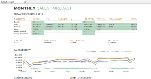

{}

PDF (Portable Document Format) represents documents independently of the software, hardware, and operating system used to create those documents. A PDF file can be documents with any combination of text, graphics, and images in a device-independent and resolution-independent manner. PDF files are often compressed, so they take up less space than the original file.

At times, you need to convert a Microsoft Excel file to PDF. For this, you require a fast, secure, accurate and reliable solution that lets you distribute PDF documents around the world. There are numerous conversion tools that can perform this task. But you have to make sure that the layout of the original Excel document is retained in the output PDF file. Images, charts, shapes, data formatting, fonts, attributes, colors, page setup settings, text orientation, borders, charts etc. should be rendered accurately and precisely. [Aspose.Cells](https://products.aspose.com/cells/nodejs-cpp/) ensures high-fidelity conversion.

This document is designed to provide comprehensive understanding of how a Microsoft Excel document (containing images, charts, formatting etc.) can be converted to PDF. To that end, it shows how to create a simple console application in Node.js that converts an Excel file to PDF using Aspose.Cells API. The conversion is performed with a high degree of precision and accuracy.

{}

## **Converting Excel to PDF**

This example uses an Excel file (SampleInput.xlsx) as a template. The workbook contains worksheets with charts and images. Each worksheet contains different types of formats using fonts, attributes, colors, shading effects, and borders. There's a column chart on the first worksheet and an image on the last.

### **The Template Excel File**

The template file has three worksheets, including charts and images as Media. The first worksheet has charts and the last worksheet has an image as shown below in the screenshots.

|||
| :- | :- |
|The first worksheet **(Sales Forecast)**|The second worksheet **(Sales Report)**|
|||
|The third worksheet **(Data Entry)**|The last worksheet **(Image)**|

### **Conversion Process**

```javascript
const path = require("path");
const AsposeCells = require("aspose.cells.node");

// The path to the documents directory.
const dataDir = path.join(__dirname, "data");
const designerFile = path.join(dataDir, "SampleInput.xlsx");
const pdfFile = path.join(dataDir, "Output.out.pdf");

try {
// Open the template excel file
const wb = new AsposeCells.Workbook(designerFile);

// Save the pdf file.
wb.save(pdfFile, AsposeCells.SaveFormat.Pdf);
} catch (e) {
console.log(e.message);
}
```

{}

If the spreadsheet contains formulas, it is best to call  [Workbook.calculateFormula()](https://reference.aspose.com/cells/nodejs-cpp/workbook/#calculateFormula--) method just before rendering the spreadsheet to PDF. Doing so ensures that formula dependent values are recalculated, and the correct values are rendered in the PDF.

{}

### **Result**

When the above code has been run, a PDF file is created in the Files folder in your application directory.
The following screenshots show the PDF pages. Note that headers and footers are also retained in the output PDF file.

|||
| :- | :- |
|The first worksheet **(Sales Forecast)**|The second worksheet **(Sales Report)**|
|||
|The third worksheet **(Data Entry)**|The last worksheet **(Image)**|
