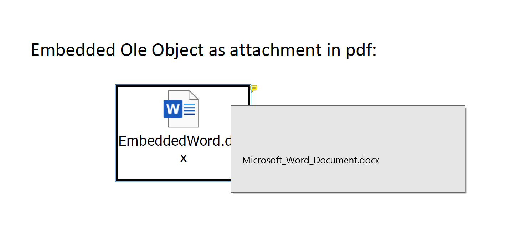

---  
title: Embed Attachment to PDF with Node.js via C++  
linktitle: Embed Attachment to PDF  
type: docs  
weight: 380  
url: /nodejs-cpp/embed-attachment-to-pdf/  
description: Learn how to embed an Ole Object as an attachment in a PDF using Aspose.Cells for Node.js via C++.  
---  

In Excel, you can insert an Ole Object with source data ([embedded-attachments-example.xlsx](embedded-attachments-example.xlsx)). Double click the Ole Object, and the embedded file will be opened.

Generally, while converting to PDF, the Ole Object will be rendered as an icon or a thumbnail without the Ole Object source data. With option [PdfSaveOptions.getEmbedAttachments()](https://reference.aspose.com/cells/nodejs-cpp/pdfsaveoptions/#getEmbedAttachments--) you can embed the Ole Object source data as an attachment in PDF. You can double-click the icon or the thumbnail in PDF to open the source file of the Ole Object.

```javascript
const AsposeCells = require("aspose.cells.node");
const path = require("path");

// The path to the documents directory.
const dataDir = path.join(__dirname, "data");
const filePath = path.join(dataDir, "embedded-attachments-example.xlsx");

// Open the template file
const wb = new AsposeCells.Workbook(filePath);

// Set to embed Ole Object attachment.
const pdfSaveOptions = new AsposeCells.PdfSaveOptions();
pdfSaveOptions.setEmbedAttachments(true);

// Save the pdf file with PdfSaveOptions
wb.save("output.pdf", pdfSaveOptions);
```

  
  