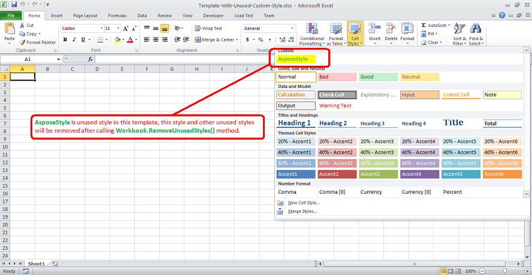

---  
title: Remove Unused Styles inside the Workbook with Node.js via C++  
linktitle: Remove Unused Styles inside the Workbook  
type: docs  
weight: 340  
url: /nodejs-cpp/remove-unused-styles-inside-the-workbook/  
description: Learn how to remove unused styles from a workbook using Aspose.Cells for Node.js via C++.  
ai_search_scope: cells_nodejscpp
ai_search_endpoint: "https://docsearch.api.aspose.cloud/ask"
---  

{}  
Unused styles in Excel files not only take up space but also cause performance issues while converting to different formats like PDF, HTML, etc. Aspose.Cells provides the [**Workbook.removeUnusedStyles()**](https://reference.aspose.com/cells/nodejs-cpp/workbook/#removeUnusedStyles--) to remove all the unused styles inside the workbook.  
{}  

The following code explains the usage of [**Workbook.removeUnusedStyles()**](https://reference.aspose.com/cells/nodejs-cpp/workbook/#removeUnusedStyles--). The code loads the [template excel file](5115520.xlsx) which you can download from the provided link. It contains an unused style named **AsposeStyle**; this style and all other unused styles will be removed after the execution of the code.  

  

```javascript
const path = require("path");
const AsposeCells = require("aspose.cells.node");

// The path to the documents directory.
const dataDir = path.join(__dirname, "data");
const filePath = path.join(dataDir, "Template-With-Unused-Custom-Style.xlsx");

// Load template excel file containing unused styles
const workbook = new AsposeCells.Workbook(filePath);

// Remove all unused styles inside the template this will also remove AsposeStyle which is an unused style inside the template
workbook.removeUnusedStyles();

// Save the file
workbook.save(path.join(dataDir, "output_out.xlsx"));
```  
  

