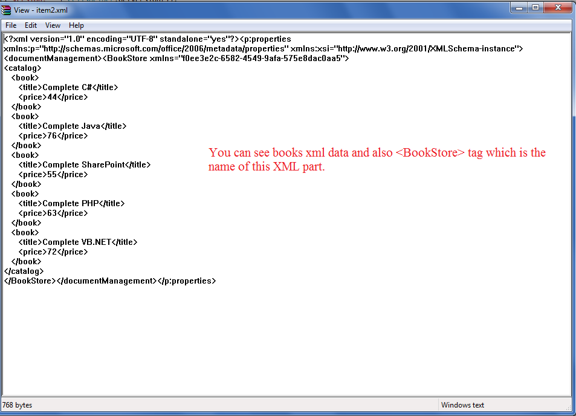

---  
title: Use Custom XML Parts in Aspose.Cells with Node.js via C++  
linktitle: Use Custom XML Parts in Aspose.Cells  
type: docs  
weight: 390  
url: /nodejs-cpp/use-custom-xml-parts-in-aspose-cells/  
description: Learn how to use custom XML parts in Aspose.Cells for Node.js via C++. Integrate external XML data within Excel files seamlessly.  
ai_search_scope: cells_nodejscpp  
ai_search_endpoint: "https://docsearch.api.aspose.cloud/ask"  
---  

## Using Custom XML Parts in Aspose.Cells

Custom XML Parts are XML data stored by various applications such as SharePoint inside an Excel file. This data is consumed by applications that need it. Microsoft Excel does not use this data, so there is no GUI to add it. You can view this data by changing the extension of an **.xlsx** file to **.zip** and then opening it with **WinZip**. You can also open the ZIP file using any third‑party Windows zip utility such as WinRAR or WinZip. The data is present inside the **customXml** folder.

You can add custom XML parts using Aspose.Cells via the [**ContentTypePropertyCollection**](https://reference.aspose.com/cells/nodejs-cpp/contenttypepropertycollection/) method.

The following sample code uses the **ContentTypePropertyCollection** method to add the **Book Catalog XML**, naming it **BookStore**. The following image shows the result of this code. As you can see, the Book Catalog XML is added inside the **BookStore** node, which is the name of this property.




## Node.js code to use custom XML parts

```javascript
const path = require("path");
const AsposeCells = require("aspose.cells.node");

// The path to the documents directory.
const dataDir = path.join(__dirname, "data");
const filePath = path.join(dataDir, "output.xlsx");

// The sample XML that will be injected to Workbook
const booksXML = `<catalog>
<book>
<title>Complete C#</title>
<price>44</price>
</book>
<book>
<title>Complete Java</title>
<price>76</price>
</book>
<book>
<title>Complete SharePoint</title>
<price>55</price>
</book>
<book>
<title>Complete PHP</title>
<price>63</price>
</book>
<book>
<title>Complete VB.NET</title>
<price>72</price>
</book>
</catalog>`;

// Create an instance of Workbook class
const workbook = new AsposeCells.Workbook();

// Add Custom XML Part to ContentTypePropertyCollection
workbook.getContentTypeProperties().add("BookStore", booksXML);

// Save the resultant spreadsheet
workbook.save(filePath);
```

## Related Article

- [Adding Custom Properties visible inside Document Information Panel](/cells/nodejs-cpp/adding-custom-properties-visible-inside-document-information-panel/)  

