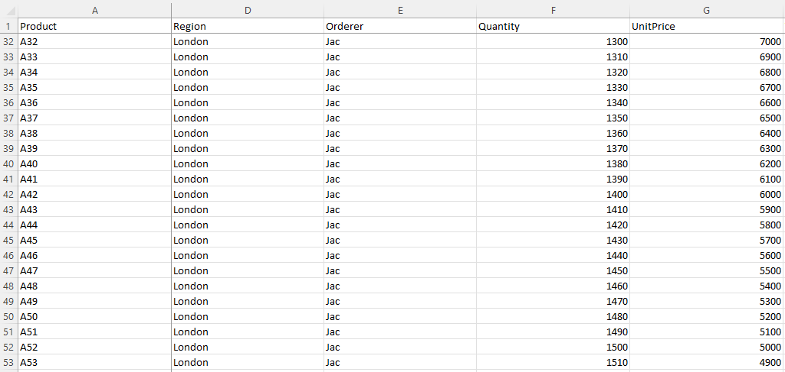

---  
title: Freeze panes of Excel Worksheet with Node.js via C++  
linktitle: Freeze panes  
type: docs  
weight: 190  
url: /nodejs-cpp/how-to-freeze-panes-of-excel-worksheet  
description: In this article, you will learn how to freeze panes of Excel Worksheets programmatically using Aspose.Cells for Node.js via C++.  
keywords: Freeze panes, Freeze window.  
ai_search_scope: cells_nodejscpp
ai_search_endpoint: "https://docsearch.api.aspose.cloud/ask"
---  

## **Introduction**  

In this article, we will learn How to Freeze Panes. When you have a huge amount of data under a common heading, you are unable to see the heading when scrolled down the worksheet. And each record contains many data. You can freeze panes so that you can see that frozen portion even when the rest of the data is being scrolled. You can easily see headers in the top rows or first columns. Freezing and unfreezing panes only changes the view of the data without changing the data itself.  

## **In Excel**  

****  

1. If you want to freeze panes, freeze rows and columns, then first select a cell (such as B2).  
2. Click View > Freeze Panes.  
3. On the drop-down menu, click Freeze Panes.  
4. If you scroll down or right, the first row and column are frozen.  

****  

As you can see, 1st Row and column A are Frozen, the second row is 32 and the second visible column is D.  

Freeze panes let you view your large data without keeping track of Row or Column label.  

## **Freeze Panes with Aspose.Cells for Node.js via C++**  
It's simple to freeze panes with Aspose.Cells for Node.js via C++. Please use the [**Worksheet.freezePanes(number, number, number, number)**](https://reference.aspose.com/cells/nodejs-cpp/worksheet/#freezePanes-number-number-number-number-) method to freeze panes at the selected Cell.  
1. Construct Workbook to open the file or create an empty file.  
2. Freeze panes with Worksheet.freezePanes() method.  
3. Save the file.  

```javascript
const path = require("path");
const AsposeCells = require("aspose.cells.node");

// The path to the documents directory.
const dataDir = path.join(__dirname, "data");
// Instantiate a new Workbook.
const workbook = new AsposeCells.Workbook(path.join(dataDir, "Freeze.xlsx")); 
// Freezing panes at the cell B2
workbook.getWorksheets().get(0).freezePanes("B2", 1, 1);
// Saving the file
workbook.save("frozen.xlsx");
```  

Attached [sample source Excel file](Freeze.xlsx).  
  

