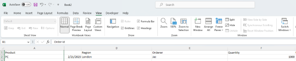

---  
title: Freeze First Column(s) of Excel Worksheet with Node.js via C++  
linktitle: Freeze Columns  
type: docs  
weight: 190  
url: /nodejs-cpp/how-to-freeze-columns-of-excel-worksheet  
description: Learn how to freeze left columns of Excel Worksheets programmatically using Aspose.Cells for Node.js via C++.  
keywords: Freeze left columns, Freeze first columns, Lock the column(s)  
---  

## **Introduction**  

In this article, we will learn how to freeze left column(s). When you have a huge amount of data in a row, you may be unable to see the left columns when horizontally scrolled down the worksheet. You can freeze and lock first column(s) so that you can see that frozen portion even when the rest of the data is being scrolled. You can easily see headers in the left columns.  

## **Freeze Columns In Excel**  

****  

1. If you want to freeze left column(s), then first select the column under the column that needs to be frozen.
2. Click View > Freeze Panes.
3. On the drop-down menu, click Freeze First column.
4. If you scroll down, the first column is always in the left view.

****  

As you can see, the 1st column is frozen, and the first column is always locked at the top of the view when you scroll horizontally.

Freeze Columns let you view your long data without any hassle of keeping track of the first column.

## **Freeze Columns with Aspose.Cells for Node.js via C++**  
It's simple to freeze first column(s) with Aspose.Cells for Node.js via C++.  
Please use the [**Worksheet.freezePanes(number, number, number, number)**](https://reference.aspose.com/cells/nodejs-cpp/worksheet/#freezePanes-number-number-number-number-) method to freeze column(s) at the selected column.  
1. Construct Workbook to open the file or create an empty file.
2. Freeze the first column with Worksheet.freezePanes() method.
3. Save the file.

```javascript
const path = require("path");
const AsposeCells = require("aspose.cells.node");

// The path to the documents directory.
const dataDir = path.join(__dirname, "data");
const filePath = path.join(dataDir, "Freeze.xlsx");
// Instantiate a new Workbook.
const workbook = new AsposeCells.Workbook(filePath);
// Freezing panes at the second column
workbook.getWorksheets().get(0).freezePanes("B1", 0, 1);
// Saving the file
workbook.save("frozen.xlsx");
```  

Attached [sample source Excel file](Freeze.xlsx).  
  