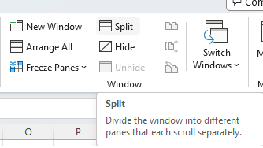

## **Introduction**

In this article, we will learn how to display certain rows and/or columns in separate panes by splitting the worksheet into two or four parts. When working with large datasets, we need to see a few areas of the same worksheet at a time to compare different subsets of data. The split screen function can meet your needs.

## **How to split screen in Excel**
To split up a worksheet into two or four parts, do as the following:

1. Select the row/column/cell before which you want to place the split.
2. On the View tab, in the Windows group, click the Split button.

****

## **Split worksheet vertically on columns**

To separate two areas of the spreadsheet vertically, select the column to the right of the column where you wish the split to appear and click the Split button in Excel.

It's easy to split worksheet vertically on columns programmatically with Aspose.Cells for Node.js via C++, we only need to select one cell in the top row as active cell, then split with [**Worksheet.split()**](https://reference.aspose.com/cells/nodejs-cpp/worksheet/#split--) method.

```javascript
const path = require("path");
const AsposeCells = require("aspose.cells.node");

// The path to the documents directory.
const dataDir = path.join(__dirname, "data");
const filePath = path.join(dataDir, "Book1.xlsx");

// Instantiate a new Workbook.
const workbook = new AsposeCells.Workbook(filePath);

const sheet = workbook.getWorksheets().get(0);

// Sets C1 cell in the top row as the active cell.
sheet.setActiveCell("C1");

// Split worksheet vertically on columns
sheet.split();
```

## **Split worksheet horizontally on rows**
To separate your Excel window horizontally, select the row below the row where you want the split to occur in Excel.

It's easy to split worksheet horizontally on rows programmatically with Aspose.Cells for Node.js via C++, we only need to select one cell in the left column as active cell, then split with [**Worksheet.split()**](https://reference.aspose.com/cells/nodejs-cpp/worksheet/#split--) method.

```javascript
const path = require("path");
const AsposeCells = require("aspose.cells.node");

// The path to the documents directory.
const dataDir = path.join(__dirname, "data");
const filePath = path.join(dataDir, "Book1.xlsx");
// Instantiate a new Workbook.
const workbook = new AsposeCells.Workbook(filePath);

const sheet = workbook.getWorksheets().get(0);

// Sets A6 cell in the left column as the active cell.
sheet.setActiveCell("A6");

// Split worksheet horizontally on rows
sheet.split();

workbook.save("dest.xlsx");
```

## **Split worksheet into four parts**
To view four different sections of the same worksheet simultaneously, split your screen both vertically and horizontally in Excel.

It's easy to split worksheet vertically on columns programmatically with Aspose.Cells for Node.js via C++, we only need to select one cell not in the first row and column as active cell, then split with [**Worksheet.split()**](https://reference.aspose.com/cells/nodejs-cpp/worksheet/#split--) method.

```javascript
const path = require("path");
const AsposeCells = require("aspose.cells.node");

// The path to the documents directory.
const dataDir = path.join(__dirname, "data");
const filePath = path.join(dataDir, "Book1.xlsx");

// Instantiate a new Workbook.
const workbook = new AsposeCells.Workbook(filePath);

const sheet = workbook.getWorksheets().get(0);

// Sets E6 cell as the active cell.
sheet.setActiveCell("E6");

// Split worksheet into four parts
sheet.split();
```

## **How to remove split**
To remove the worksheet splitting, just click the Split button again.

Aspose.Cells for Node.js via C++ provides a [**Worksheet.removeSplit()**](https://reference.aspose.com/cells/nodejs-cpp/worksheet/#removeSplit--) method to remove split setting.

```javascript
const path = require("path");
const AsposeCells = require("aspose.cells.node");

// The path to the documents directory.
const dataDir = path.join(__dirname, "data");
const filePath = path.join(dataDir, "Book1.xlsx");

// Instantiate a new Workbook.
const workbook = new AsposeCells.Workbook(filePath);
const sheet = workbook.getWorksheets().get(0);

// Remove split.
sheet.removeSplit();

// Split worksheet into four parts
sheet.split();
```

