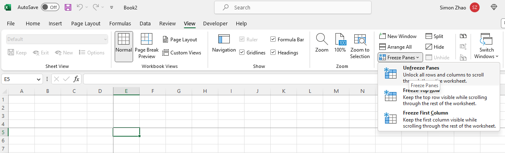

## **Introduction**

In this article, we will learn how to unfreeze rows, columns, and panes. If worksheets in the Excel files are frozen, sometimes we want to unfreeze the worksheet or adjust frozen rows, columns, or panes.


## **In Excel**

1. Click View tab > Freeze Panes > Unfreeze Panes.

****


## **Unfreeze Rows, Columns or Panes with Aspose.Cells for Node.js via C++**
It's simple to unfreeze panes with Aspose.Cells for Node.js via C++. Please use the [**Worksheet.unfreezePanes**](https://reference.aspose.com/cells/nodejs-cpp/worksheet/#unfreezePanes) method to unfreeze panes.

1. Construct Workbook to open the frozen file.
2. Unfreeze panes with Worksheet.unfreezePanes() method.
3. Save the file.

```javascript
const path = require("path");
const AsposeCells = require("aspose.cells.node");

const dataDir = path.join(__dirname, "data");
const frozenFilePath = path.join(dataDir, "Frozen.xlsx");

const workbook = new AsposeCells.Workbook(frozenFilePath); 
workbook.getWorksheets().get(0).unFreezePanes();
workbook.save("Unfrozen.xlsx");
```

Attached [sample source Excel file](Frozen.xlsx).
