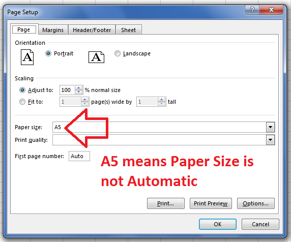

## **Possible Usage Scenarios**

Most of the time, the paper size of the worksheet is automatic. When it is automatic, it is often set as *Letter*. Sometimes the user sets the paper size of the worksheet as per their requirements. In this case, the paper size is not automatic. You can find if the worksheet paper size is automatic or not using the [**Worksheet.isAutomaticPaperSize()**](https://reference.aspose.com/cells/nodejs-cpp/pagesetup/#isAutomaticPaperSize--) property.

## **Determine if Paper Size of Worksheet is Automatic**

The sample code given below loads the following two Excel files

- [samplePageSetupIsAutomaticPaperSize-False.xlsx](48496681.xlsx)
- [samplePageSetupIsAutomaticPaperSize-True.xlsx](48496682.xlsx)

and find if the paper size of their first worksheet is automatic or not. In Microsoft Excel, you can check if the paper size is automatic or not via the Page Setup window as shown in this screenshot.



## **Sample Code**

```javascript
const path = require("path");
const AsposeCells = require("aspose.cells.node");

// The path to the documents directory.
const dataDir = path.join(__dirname, "data");
const wb1 = new AsposeCells.Workbook(path.join(dataDir, "samplePageSetupIsAutomaticPaperSize-False.xlsx"));
const wb2 = new AsposeCells.Workbook(path.join(dataDir, "samplePageSetupIsAutomaticPaperSize-True.xlsx"));

// Access first worksheet of both workbooks
const ws11 = wb1.getWorksheets().get(0);
const ws12 = wb2.getWorksheets().get(0);

// Print the PageSetup.IsAutomaticPaperSize property of both worksheets
console.log("First Worksheet of First Workbook - IsAutomaticPaperSize: " + ws11.getPageSetup().isAutomaticPaperSize());
console.log("First Worksheet of Second Workbook - IsAutomaticPaperSize: " + ws12.getPageSetup().isAutomaticPaperSize());
```

## **Console Output**

Here is the console output of the above sample code when executed with the given sample Excel files.



First Worksheet of First Workbook - IsAutomaticPaperSize: False

First Worksheet of Second Workbook - IsAutomaticPaperSize: True



