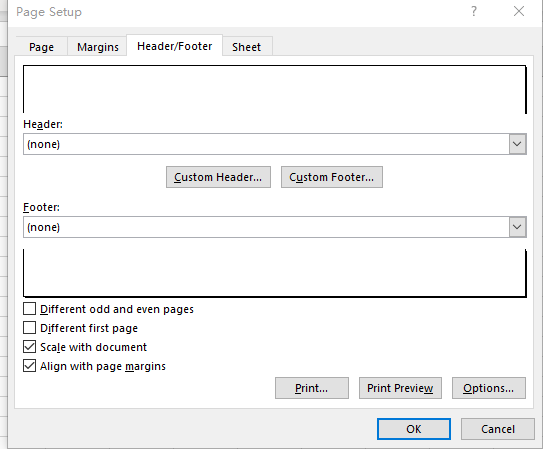

{}

MS Excel supports setting different headers and footers for the first page, odd pages, and even pages since Excel 2007.
Aspose.Cells for Node.js via C++ supports the same feature.

{}

## **Setting Different Headers and Footers in MS Excel**

****

1. Click **page Layout > Print Titles > Header/Footer**.
1. Check **Different Odd and Even Pages** or **Different first page**.
1. Enter different headers and footers.

## **Setting Different Headers and Footers with Aspose.Cells for Node.js via C++**

Aspose.Cells behaves the same as Excel.
1. Sets the flags [PageSetup.isHFDiffOddEven()](https://reference.aspose.com/cells/nodejs-cpp/pagesetup/#isHFDiffOddEven--) and [PageSetup.isHFDiffFirst()](https://reference.aspose.com/cells/nodejs-cpp/pagesetup/#isHFDiffFirst--) 
1. Enter different headers and footers.
```javascript
const path = require("path");
const AsposeCells = require("aspose.cells.node");

// The path to the documents directory.
const dataDir = path.join(__dirname, "data");
const filePath = path.join(dataDir, "sample.xlsx");
// Loads the workbook which contains hidden external links
const wb = new AsposeCells.Workbook(filePath);

// Gets the setting of page setup.
const pageSetup = wb.getWorksheets().get(0).getPageSetup();
// Sets different odd and even pages
pageSetup.setIsHFDiffOddEven(true);
pageSetup.setHeader(1, "I am the header of the Odd page.");
pageSetup.setEvenHeader(1, "I am the header of the Even page.");
// Sets different first page
pageSetup.setIsHFDiffFirst(true);
pageSetup.setFirstPageHeader(1, "I am the header of the First page.");
```

