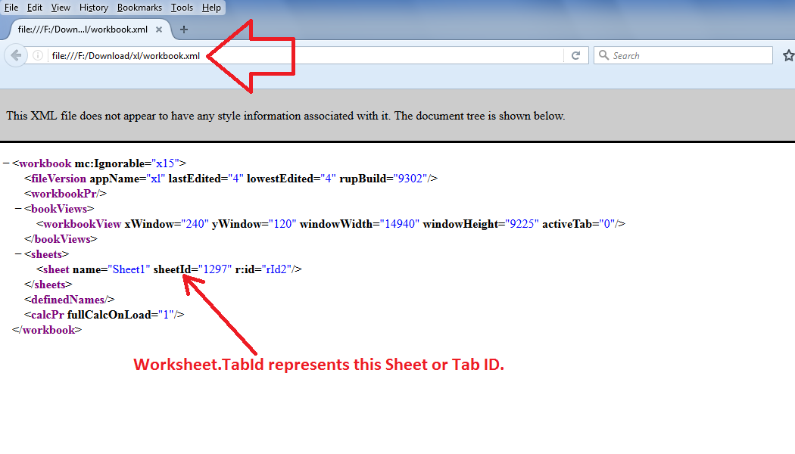

## **Possible Usage Scenarios**

*Sheet.SheetId* property is available inside the *DocumentFormat.OpenXml.Spreadsheet* module and is part of OpenXml. You can see this property and its value inside *workbook.xml* as shown in the following screenshot. Aspose.Cells provides the equivalent property as [**Worksheet.getTabId()**](https://reference.aspose.com/cells/nodejs-cpp/worksheet/#getTabId--).



## **Utilize Sheet.SheetId property of OpenXml using Aspose.Cells for Node.js via C++**

The following sample code loads the [sample Excel file](51740716.xlsx), reads its Sheet or Tab Id, then assigns it new Tab Id and saves it as [output Excel file](51740717.xlsx). Please also see the console output of the code given below for a reference.

## **Sample Code**

```javascript
const path = require("path");
const AsposeCells = require("aspose.cells.node");

// The path to the documents directory.
const dataDir = path.join(__dirname, "data");
const filePath = path.join(dataDir, "sampleSheetId.xlsx");

// Load source Excel file
const wb = new AsposeCells.Workbook(filePath);

// Access first worksheet
const ws = wb.getWorksheets().get(0);

// Print its Sheet or Tab Id on console
console.log("Sheet or Tab Id: " + ws.getTabId());

// Change Sheet or Tab Id
ws.setTabId(358);

// Save the workbook
wb.save("outputSheetId.xlsx");
```

## **Console Output**



Sheet or Tab Id: 1297


