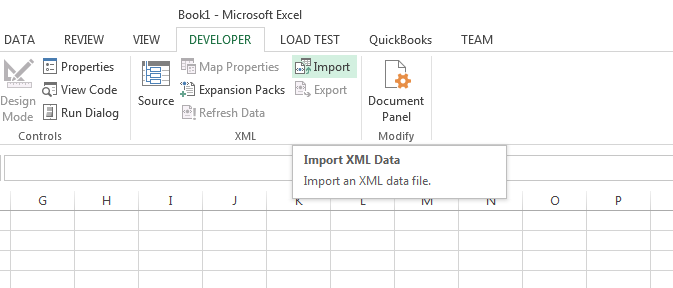

{}

Aspose.Cells allows you to import the XML map inside the workbook using the [**Workbook.importXml(string, string, number, number)**](https://reference.aspose.com/cells/nodejs-cpp/workbook/#importXml-string-string-number-number-) method. You can import XML Map using Microsoft Excel with the following steps:

- Select **Developer** tab
- Click **Import** in the XML section and follow the required steps.

You will need to provide your XML data to complete the import. Here is a [sample XML data](5115037.txt) that you can use for testing.

{}

## **Import XML Map using Microsoft Excel**

The following screenshot shows how to import XML Map using Microsoft Excel.

||
| :- |

## **Import XML Map using Aspose.Cells for Node.js via C++**

The following sample code shows how to make use of the [**Workbook.importXml(string, string, number, number)**](https://reference.aspose.com/cells/nodejs-cpp/workbook/#importXml-string-string-number-number-). It generates the [output excel file](5115036.xlsx) as shown in this screenshot.

||
| :- |

```javascript
const path = require("path");
const AsposeCells = require("aspose.cells.node");

// The path to the documents directory.
const dataDir = path.join(__dirname, "data");

// Create a workbook
const workbook = new AsposeCells.Workbook();

// Local XML file path
const XML = path.join(dataDir, "sampleXML.txt");

// Import your XML Map data starting from cell A1
workbook.importXml(XML, "Sheet1", 0, 0);

// Save workbook
workbook.save(path.join(dataDir, "output_out.xlsx"));
```

## **Advanced topics**
- [Add XML Map inside the Workbook using XmlMapCollection.add() method](/cells/nodejs-cpp/add-xml-map-inside-the-workbook-using-xmlmapcollection-add-method/)
- [Export XML Data linked to XML Map inside the Workbook](/cells/nodejs-cpp/export-xml-data-linked-to-xml-map-inside-the-workbook/)
- [Find the Root Element Name of XML Map](/cells/nodejs-cpp/find-the-root-element-name-of-xml-map/)
- [Link Cells to XML Map Elements](/cells/nodejs-cpp/link-cells-to-xml-map-elements/)
- [Query Cell Areas Mapped to XML Map Path using Worksheet.xmlMapQuery() method](/cells/nodejs-cpp/query-cell-areas-mapped-to-xml-map-path-using-worksheet-xmlmapquery-method/)

