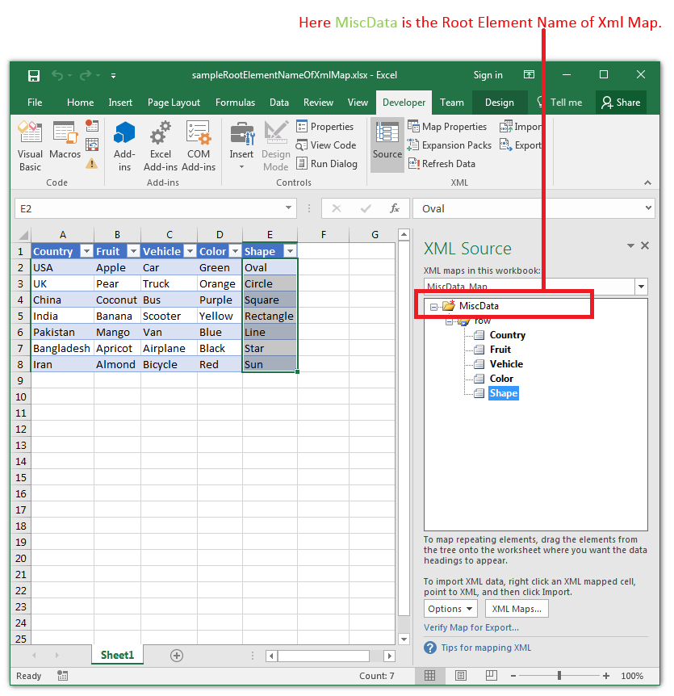

## **Possible Usage Scenarios**

You can find the *Root Element Name of Xml Map* using Aspose.Cells for Node.js via C++ with the [**XmlMap.getRootElementName()**](https://reference.aspose.com/cells/nodejs-cpp/xmlmap/#getRootElementName--) property. The following screenshot shows the root element name of the XML Map in Microsoft Excel.



## **Sample Code**

The following sample code loads the [sample Excel file](55541789.xlsx) and accesses the first XML Map and prints its [**XmlMap.getRootElementName()**](https://reference.aspose.com/cells/nodejs-cpp/xmlmap/#getRootElementName--) property. Please see the console output of the sample code given below.

```javascript
const path = require("path");
const AsposeCells = require("aspose.cells.node");

// The path to the documents directory.
const dataDir = path.join(__dirname, "data");
const filePath = path.join(dataDir, "sampleRootElementNameOfXmlMap.xlsx");

// Load sample Excel file having Xml Map
const wb = new AsposeCells.Workbook(filePath);

// Access first Xml Map inside the Workbook
const xmap = wb.getWorksheets().getXmlMaps().get(0);

// Print Root Element Name of Xml Map on Console
console.log("Root Element Name Of Xml Map: " + xmap.getRootElementName());
```

## **Console Output**



Root Element Name Of Xml Map: MiscData


