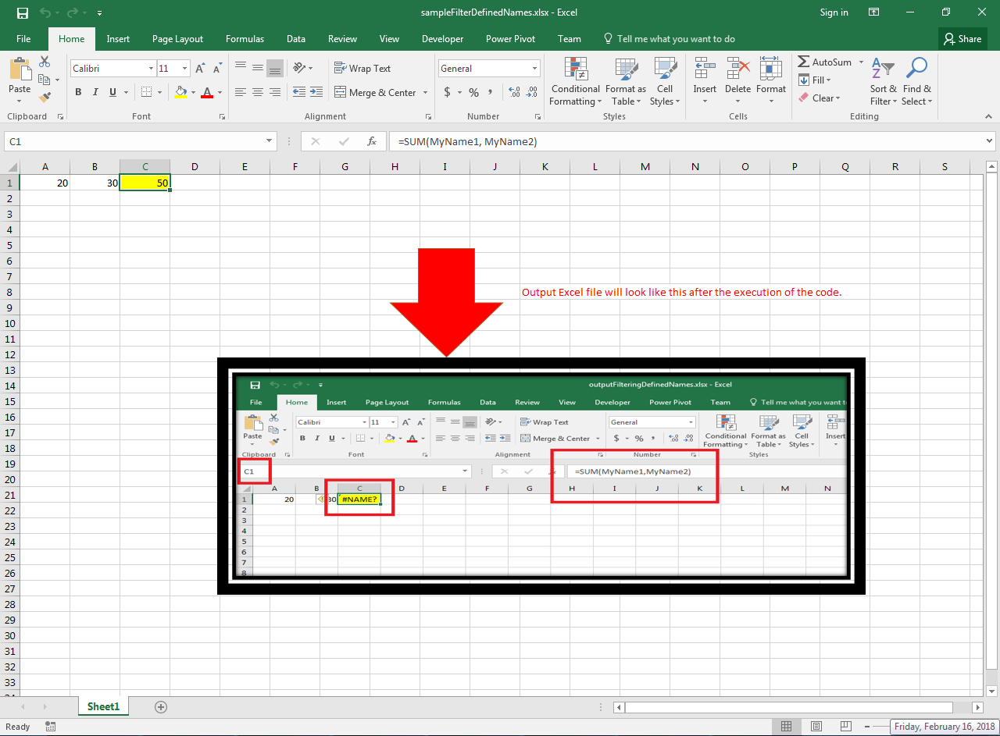

## **Possible Usage Scenarios**

Aspose.Cells allows you to filter or remove defined names present inside the workbook. Please use **LoadDataFilterOptions.DEFINED_NAMES** to load defined names and use ~**LoadDataFilterOptions.DEFINED_NAMES** to remove them while loading the workbook. Please note that if you remove defined names, formulas inside the workbook may break.

## **Filter Defined Names while loading Workbook**

The following sample code loads the [sample Excel file](61767860.xlsx) which has a formula in cell **C1** containing the defined names, i.e., `=SUM(MyName1, MyName2)`. Since we are using ~**LoadDataFilterOptions.DEFINED_NAMES** to remove the defined names while loading the workbook, the formula in cell C1 of the [output Excel file](61767861.xlsx) breaks, and you see `#NAME?` instead. Please see the following screenshot that shows the effect of the code on the sample Excel file.

## **Sample Code**


<!---->