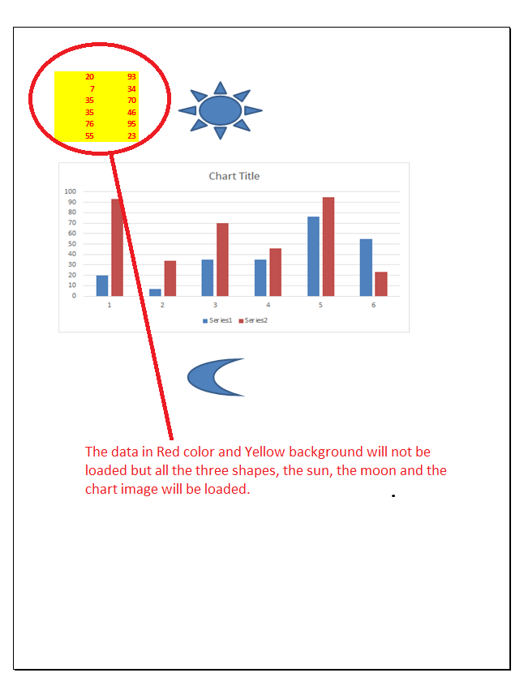
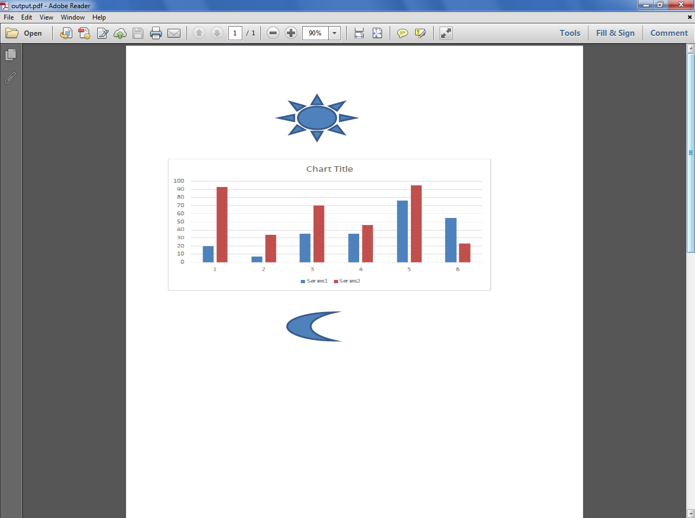

{}

Sometimes, you want to specify which kind of data should be loaded when building the workbook from the template file. Filtering loaded data can improve performance for your specific purpose, especially when using [LightCells APIs](/cells/nodejs-java/using-lightcells-api/). Please use the [**LoadOptions.setLoadFilter()**](https://reference.aspose.com/cells/nodejs/LoadOptions#setLoadFilter) method for this purpose.

{}

The following sample code loads only shape objects while loading the workbook from the [template file](5115552.xlsx), which you can download from the given link. The following screenshot shows the [template file](5115552.xlsx) contents and also explains that the data in red color and yellow background will not be loaded because the [**LoadOptions.setLoadFilter()**](https://reference.aspose.com/cells/nodejs/LoadOptions#setLoadFilter) method has been set to **aspose.cells.LoadDataFilterOptions.ALL & ~aspose.cells.LoadDataFilterOptions.CELL_DAT**.

The following screenshot shows the [output PDF](5115555.pdf), which you can download from the given link. Here you can see that the data in red color and yellow background is not present, but all shapes are there.


<!---->