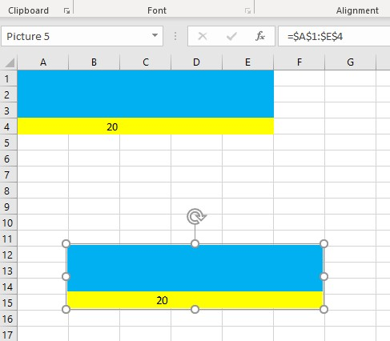

{}

Sometimes, you have a linked shape in your Excel file which is linked to some cell. In Microsoft Excel, changing the value of the linked cell also changes the value of the linked shape. This also works fine with Aspose.Cells if you want to save your workbook in XLS or XLSX format. However, if you want to save your workbook in PDF or HTML format, then you will have to call [**Worksheet.getShapes().updateSelectedValue()**](https://reference.aspose.com/cells/python-java/asposecells.api/shapecollection#updateSelectedValue()) method to refresh the value of the linked shape.

{}

## Example

The following screenshot shows the source Excel file used in the sample code below. It has a linked picture linked to cells A1 to E4. We will change the value of cell B4 with Aspose.Cells and then call [**Worksheet.getShapes().updateSelectedValue()**](https://reference.aspose.com/cells/python-java/asposecells.api/shapecollection#updateSelectedValue()) method to refresh the value of the picture and save it in PDF format.

You can download the [source Excel file](sampleRefreshValueOfLinkedShapes.xlsx) and the [output PDF](95584292.pdf) from the given links.

### C# code to refresh the values of linked shapes


