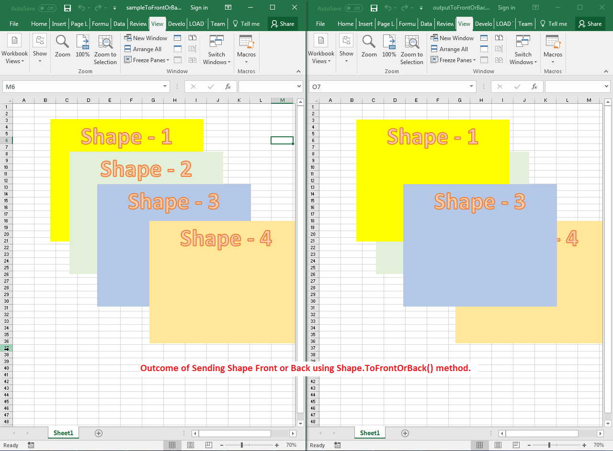

## **Possible Usage Scenarios**

When there are multiple shapes present in the same location, how they will be visible is decided by their z‑order positions. Aspose.Cells provides [**Shape.toFrontOrBack()**](https://reference.aspose.com/cells/python-java/asposecells.api/shape#toFrontOrBack(int)) method which changes the z‑order position of the shape. If you want to send a shape to the back, you use a negative number such as -1, -2, -3, etc., and if you want to send a shape to the front, you use a positive number such as 1, 2, 3, etc.

## **Bring Shape Front or Back inside the Worksheet**

The following sample code demonstrates the usage of [**Shape.toFrontOrBack()**](https://reference.aspose.com/cells/python-java/asposecells.api/shape#toFrontOrBack(int)) method. Please see the [sample Excel file](sampleToFrontOrBack.xlsx) used in the code and the [output Excel file](50528331.xlsx) generated by it. The screenshot shows the effect of the code on the sample Excel file when executed.

## **Sample Code**



