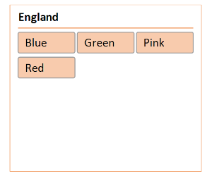

## **Rendering Slicer**
Aspose.Cells for Python via Java supports the rendering of slicer shapes. The following code snippet loads the [sample Excel file](106364974.xlsx) that contains a slicer. It converts the worksheet into an image by setting the print area that covers only the slicer. The following image is the [output image](106364975.png) that shows the rendered slicer. As you can see, the slicer has been rendered properly; it looks the same as in the sample Excel file.

## **Sample Code**

