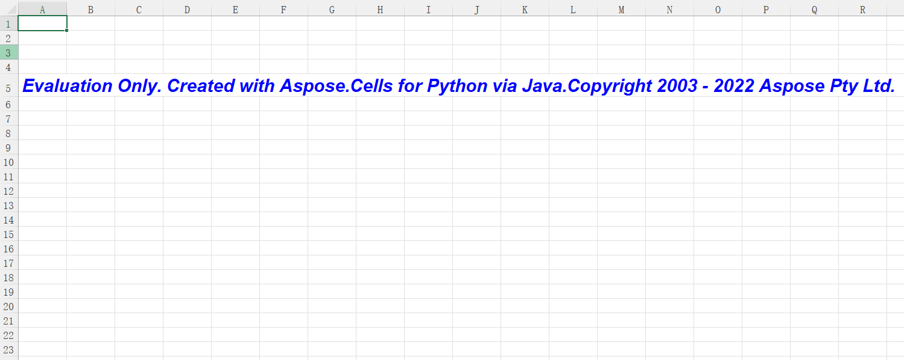

{} 

You can install an evaluation version of **Aspose.Cells** for Python via Java with `pip install aspose-cells`. The evaluation version provides absolutely the same capabilities as the licensed version of the product. Furthermore, evaluation version simply becomes licensed when you purchase a license and add a couple of lines of code to apply the license.

Once you are happy with your evaluation of **Aspose.Cells**, you can [purchase a license](https://purchase.aspose.com) at the Aspose website. Make yourself familiar with the different subscription types offered. If you have any questions, do not hesitate to contact the Aspose sales team.

Every Aspose license carries a one-year subscription for free upgrades to any new versions or fixes that come out during this time. Technical support is free and unlimited and provided both to licensed and evaluation users.

{} {} 

If you want to test **Aspose.Cells** without evaluation version limitations, request a 30-day temporary license. Please refer to [How to get a Temporary License?](https://purchase.aspose.com/temporary-license) for more information.

{}

## **Evaluation Version Limitations**

Evaluation version of **Aspose.Cells** product (without a license specified) provides full product functionality, but it is limited to open 100 files in one program and an extra worksheet with evaluation watermark.

The limitations are shown below:

### **1st Limitation: Number of Opened Files**

When running your program, you can only open 100 Excel files. If your application exceeds this number, an exception will be thrown.

### **2nd Limitation: Worksheet with Evaluation Watermark**

This worksheet will always show as the active worksheet. Only in licensed version, you can set the active worksheet to other worksheets.

## **Setting a License**

The license is a plain text XML file that contains details such as the product name, number of developers it is licensed to, subscription expiry date and so on. The file is digitally signed, so do not modify the file; even the inadvertent addition of an extra line break into the file will invalidate it.

You need to set a license before utilizing Aspose.Cells if you want to avoid its evaluation limitations. You are only required to set a license once per application or process.

The license can be loaded from a file in the following locations:

1. Explicit path.
1. Working folder.

Use the [License.setLicense](https://reference.aspose.com/cells/python-java/asposecells.api/License) method to license the component. Often the easiest way to set a license is to put the license file in the same folder as Aspose.Cells.jar and specify just the file name without path as shown in the following example:

### **Example**

In this example **Aspose.Cells** will attempt to find the license file in your working folder.



from asposecells.api import License

lic = License()
lic.setLicense("Aspose.Cells.lic")


