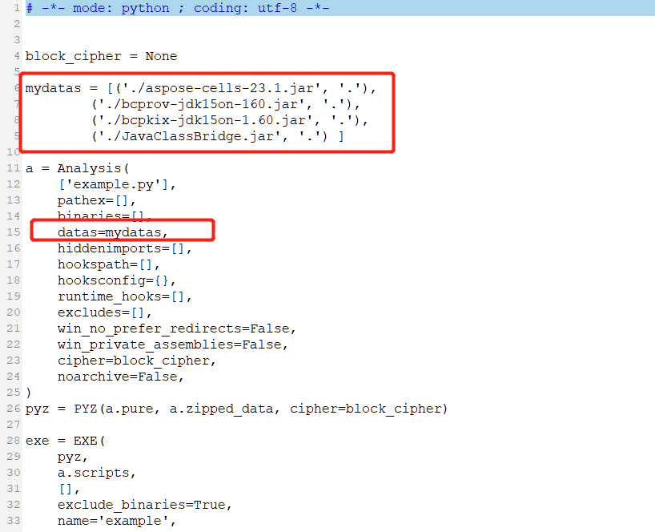

## **What is PyInstaller used for?**
PyInstaller reads a Python script written by you. It analyzes your code to discover every other module and library your script needs in order to execute. Then it collects copies of all those files – including the active Python interpreter!

## **Why use PyInstaller to package Python?**
PyInstaller is used to package Python code into standalone executable applications for various operating systems. It takes a Python script and generates a single executable file that contains all the necessary dependencies and can be run on computers that do not have Python installed. This allows for easy distribution and deployment of Python applications, as the user does not need to have Python or any required modules installed on their system in order to run the application. Additionally, PyInstaller can be used to create one‑file executables, which are single executable files that contain all of the required dependencies for the application. This can make it even easier to distribute the application, as the user only needs to download a single file.

## **How to Install PyInstaller**
PyInstaller is available as a regular Python package. The source archives for released versions are available from [PyPi](https://pypi.org/project/pyinstaller/), but it is easier to install the latest version using [pip](https://pip.pypa.io/en/stable/):


C:\> pip install pyinstaller


To upgrade an existing PyInstaller installation to the latest version, use:


C:\> pip install --upgrade pyinstaller


To install the current development version, use:


C:\> pip install https://github.com/pyinstaller/pyinstaller/tarball/


## **How do I create an EXE using PyInstaller?**
We will take a single Python file as an example to explain the packaging steps in detail. Take Python 3.11.0 as an example after installing [aspose.cells](https://pypi.org/project/aspose-cells/).

1. Create a Python sample file named [example.py](example.py).


import os
from jpype import *

__cells_jar_dir__ = os.path.dirname(__file__)
addClassPath(os.path.join(__cells_jar_dir__, "aspose-cells-23.1.jar"))
addClassPath(os.path.join(__cells_jar_dir__, "bcprov-jdk15on-160.jar"))
addClassPath(os.path.join(__cells_jar_dir__, "bcpkix-jdk15on-1.60.jar"))
addClassPath(os.path.join(__cells_jar_dir__, "JavaClassBridge.jar"))

import jpype
import asposecells
jpype.startJVM()
from asposecells.api import Workbook, FileFormatType, CellsHelper

print(CellsHelper.getVersion())
workbook = Workbook(FileFormatType.XLSX)
workbook.getWorksheets().get(0).getCells().get("A1").putValue("Hello World")
workbook.save("output.xlsx")

jpype.shutdownJVM()


2. Create a folder `C:\app` and copy `example.py` (attached) to `C:\app`.

3. Open your command prompt and run the PyInstaller command:


C:\app> pyinstaller example.py


4. Copy the JARs (`aspose-cells-xxx.jar`, `bcprov-jdk15on-160.jar`, `bcpkix-jdk15on-1.60.jar`, `JavaClassBridge.jar`). They exist in `C:\Python311\Lib\site-packages\asposecells\lib` folder, to `C:\app`.

5. Edit the file with the `.spec` suffix to add a `datas` section, like [example.spec](example.spec).

6. Run PyInstaller with the spec file:


C:\app> pyinstaller example.spec


7. Switch to the directory `C:\app\dist\example`, and you will find the `example.exe` file.
