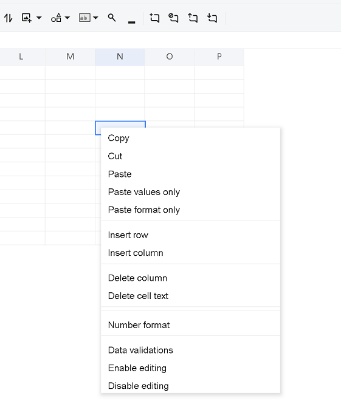

# Custom built‑in context menus
We have some built‑in context menu items, for example insert/delete row/column, and so on.  
For example, to delete the “Delete row”, “Link”, “Hide” menu items in context menus, assume the div id of GridJs is `"gridjs-divid"`:

```javascript
   // Get the parent DOM of the context menus
   const menus = document.querySelector("#gridjs-divid > div > div.x-spreadsheet-sheet > div.x-spreadsheet-contextmenu");
   var childs = menus.childNodes;
   for (var i = childs.length - 1; i >= 0; i--)
   {  
     // check the item text
     if (childs[i].childNodes[0]?.textContent === "Delete row" ||
         childs[i].childNodes[0]?.textContent === "Link" ||
         childs[i].childNodes[0]?.textContent === "Hide")
       {
         menus.removeChild(childs[i]);
       }
   }
```

After calling this function  




# Custom self‑defined context menus
We have some built‑in context menu items, for example insert/delete row/column, and so on.  
However, if a user wants to customize context menu items, we support setting context menu items in the load options.  
For example:

```javascript
        const onMyActionClick1 = (sheet) => {
            console.log('my action clicked1' +  sheet.data.name)
        };
        const onMyActionClick2 = (sheet) => {
            console.log('my action clicked2' + sheet.data.name)
        };
  xs = x_spreadsheet('#gridjs-demo', {
                updateMode: 'server',
                updateUrl: '/GridJs2/UpdateCell',
                showToolbar: true,
                mode: 'edit',
                local: 'en',
                showContextmenu: true,
		// This option is for context menus; we need to set usedefault to false to load custom context menus
                contextMenuItems: {
                    usedefault: false,
                    customItems: [{ 'key': 'key1', 'text': 'c title 11111', 'callback': onMyActionClick1 },
                                  { 'key': 'key2', 'text': 'c title 22222', 'callback': onMyActionClick2 }]
                }
            })
```

We support the following JS APIs for custom context menu items at runtime:

- **Get custom context menu items**

```javascript
xs.sheet.getCustomContextMenuItems()
```

- **Add custom context menu items**

```javascript
xs.sheet.addCustomContextMenuItems(itemsArray)
// The parameter is:
// itemsArray: the array of custom menu items; the callback function’s x parameter will be the JavaScript variable xs.sheet
// for example: [{'key':'key4','text':'menu4','callback':(x)=>{console.log('hello4444');}},
//               {'key':'key3','text':'menu3','callback':(x)=>{console.log('hello3333');}}]
```

- **Delete custom context menu items**

```javascript
xs.sheet.delCustomContextMenuItems(keysArray)()
// The parameter is:
// keysArray: the array of keys of the menu items
// for example: ['key4','key3']
```

- **Insert custom context menu item at a specified position**

```javascript
xs.sheet.insertCustomContextMenuItem(item, position)
// The parameters are:
// item: the custom menu item; the callback function’s x parameter will be the JavaScript variable xs.sheet
// for example: {'key':'key4','text':'menu4','callback':(x)=>{console.log('hello4444');}}
// position: the position for the inserted item in the items array
```

- **Update custom context menu item by the key**

```javascript
xs.sheet.updateCustomContextMenuItem(key, item)
// The parameters are:
// key: the key of the menu item
// item: the updated properties (e.g., text or callback)
// for example: {'text':'menu updated'}
```

- **Get custom context menu items for image/shape**

```javascript
xs.sheet.getImageContextMenuItems()
```

- **Add custom context menu items for image/shape**

```javascript
xs.sheet.addImageContextMenuItems(itemsArray)
// The parameter is:
// itemsArray: the array of custom menu items; the callback function’s x parameter will be the JavaScript variable xs.sheet
// for example: [{'key':'key4','text':'img operation1','callback':(x)=>{console.log('operation1 on image');}},
//               {'key':'key3','text':'img operation2','callback':(x)=>{console.log('operation2 on image');}}]
```

- **Delete custom context menu items for image/shape**

```javascript
xs.sheet.delImageContextMenuItems(keysArray)()
// The parameter is:
// keysArray: the array of keys of the menu items
// for example: ['key4','key3']
```

You can find more in our GitHub demo page: <https://github.com/aspose-cells/Aspose.Cells.Grid-for-Python-via-.NET/blob/main/Examples.GridJs/templates/index.html>
