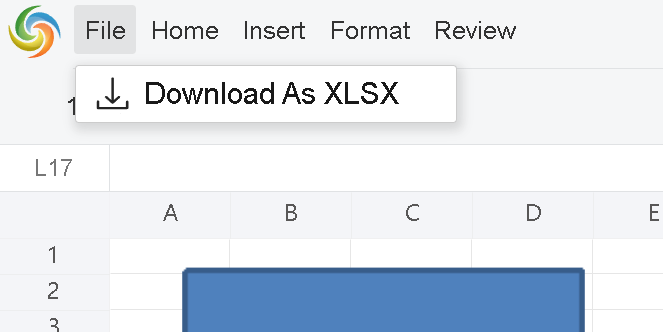
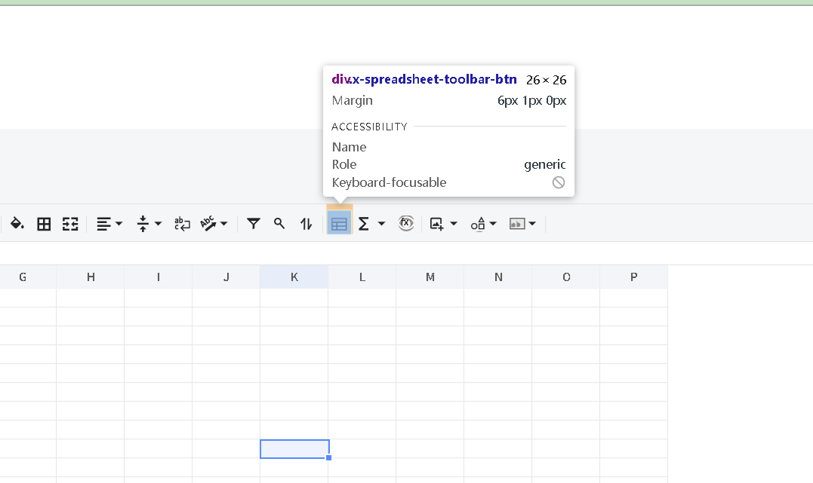
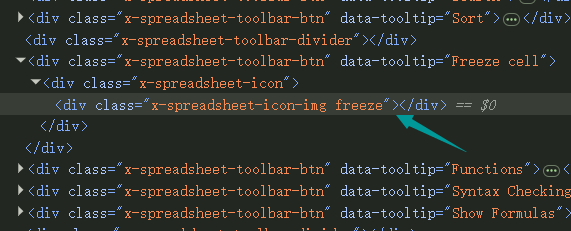
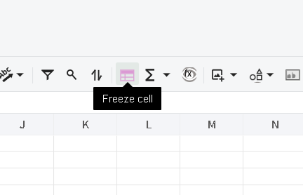

## about customize menus and toolbar buttons
we don't provide useful APIs directly .
however we can write some js function based on the dom structure to achieve it.

 
 
## Customize menubar 
for example:to keep File menu only,assume the div id of GridJs is "gridjs-divid"
```javascript
   //get menubar parent dom
   const menubar=document.querySelector("#gridjs-divid > div > div:nth-child(1) > div > div.x-spreadsheet-banner-info-s > div.x-spreadsheet-toolbar.x-spreadsheet-menubar");
   var childs = menubar.childNodes;
   
  
   for (var i = childs.length - 1; i >= 0; i--)
   {  
     // keep File menu  only
     if(childs[i].childNodes[0].childNodes[0].textContent!=="File")
       {
         menubar.removeChild(childs[i]);
       }
   }


```
After call this function 


 
## Customize items in menubar 
for example:to keep "Download As XLSX" menu item in File menu only,assume the div id of GridJs is "gridjs-divid"
```javascript
   //get menubar parent dom
   const menubar=document.querySelector("#gridjs-divid > div > div:nth-child(1) > div > div.x-spreadsheet-banner-info-s > div.x-spreadsheet-toolbar.x-spreadsheet-menubar");
   var childs = menubar.childNodes;
   
   // keep the first one ->File menu  only
   for (var i = childs.length - 1; i >= 0; i--)
   {  //find the File menu
     if(childs[i].childNodes[0].childNodes[0].textContent==="File")
       {
            var dropdownparent = childs[i].childNodes[0].childNodes[1];
            var menuitems = dropdownparent.childNodes;
            for (var ii = menuitems.length - 1; ii >=0; ii--)
            {   
	        //remove other menu item that is not "Download As XLSX"
                if (menuitems[ii].textContent !== 'Download As XLSX')
                {
                    dropdownparent.removeChild(menuitems[ii]);
                }
            }
       }
   }


```
After call this function 



## Customize toolbar items 
for example:to keep zoom button only,assume the div id of GridJs is "gridjs-divid"
```javascript
   //get toolbar parent dom
   const toolbar=document.querySelector("#gridjs-divid > div > div.x-spreadsheet-toolbar > div.x-spreadsheet-toolbar-btns");
   var childs = toolbar.childNodes;
   
  
   for (var i = childs.length - 1; i >= 0; i--)
   {  
     // keep File menu  only
     if(childs[i].getAttribute("data-tooltip")!=="Zoom")
       {
         toolbar.removeChild(childs[i]);
       }
   }


```
After call this function 


## Customize toolbar hover effect

open browser insepection window ,select the toolbar button,



then we can find the related css key for this button is:freeze



add the below css rule:
```css
.x-spreadsheet-toolbar .x-spreadsheet-toolbar-btn:hover .x-spreadsheet-icon-img.freeze,
.x-spreadsheet-toolbar .x-spreadsheet-toolbar-btn.active .x-spreadsheet-icon-img.freeze {
  background: rgba(4, 71, 33, 0.08);
  filter: brightness(0) saturate(100%) invert(27%) sepia(51%) saturate(2878%) hue-rotate(346deg) brightness(104%) contrast(97%);
}
```
the result will be :




## Customize Items in Bottom Bar

### Overview
The bottom bar contains two interactive buttons:
1. &zwnj;**Add Worksheet Button**&zwnj; (`add` class) - Creates new worksheets
2. &zwnj;**Select Worksheet Button**&zwnj; (`ellipsis` class) - Manages worksheet selection

### DOM Access
You can access these elements using:
```javascript
// Add Worksheet Button
const addButton = document.querySelector('.x-spreadsheet-icon-img.add');

// Select Worksheet Button
const selectButton = document.querySelector('.x-spreadsheet-icon-img.ellipsis');

```

### Customization Examples
1. Hide Buttons
To remove a button from the DOM:
```javascript
// Hide Add Worksheet Button
const addButton = document.querySelector('.x-spreadsheet-icon-img.add');
addButton.parentElement.removeChild(addButton);

// Hide Select Worksheet Button
const selectButton = document.querySelector('.x-spreadsheet-icon-img.ellipsis');
selectButton.parentElement.removeChild(selectButton);

```

2. Change Icons
You can replace icons using either external SVG files or inline SVG data.
```javascript
const addButton = document.querySelector('.x-spreadsheet-icon-img.add');
addButton.style.backgroundImage = "url('https://example.com/fish-icon.svg')";
// Adjust size and position
addButton.style.width = '18px';
addButton.style.height = '18px';
addButton.style.left = '0';
addButton.style.top = '0';
```

3. Change Button Behavior
You can modify the click event to customize functionality:
```javascript
const addButton = document.querySelector('.x-spreadsheet-icon-img.add');
addButton.addEventListener('click', function() {
  // Custom action here
  console.log('Custom add worksheet action');
});
```


 
