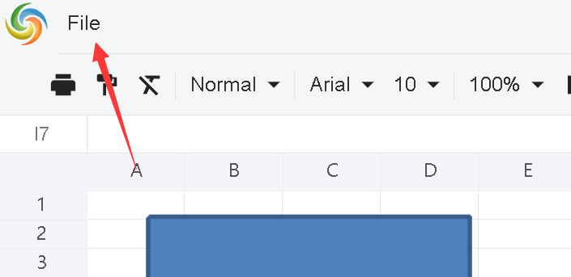
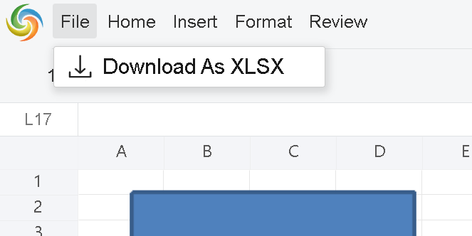
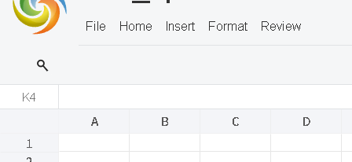
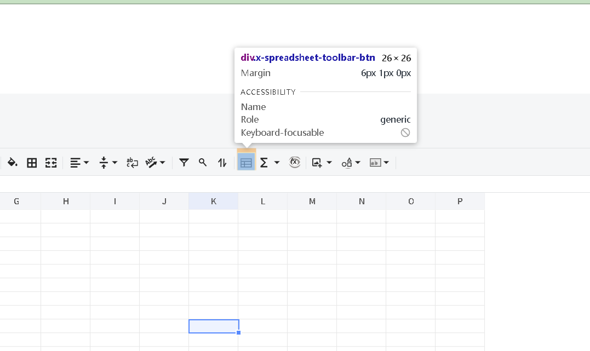
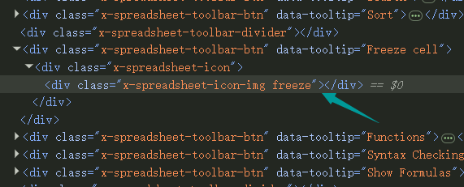
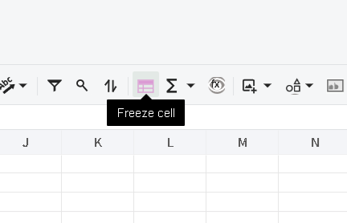

## About Customize Menus and Toolbar Buttons
We don't provide useful APIs directly.  
However, we can write some JavaScript functions based on the DOM structure to achieve it.
 
## Customize Menubar
For example, to keep the File menu only, assume the div id of GridJs is `"gridjs-divid"`:
 
```javascript
// get menubar parent DOM
   const menubar=document.querySelector("#gridjs-divid > div > div:nth-child(1) > div > div.x-spreadsheet-banner-info-s > div.x-spreadsheet-toolbar.x-spreadsheet-menubar");
   var childs = menubar.childNodes;
   
for (var i = childs.length - 1; i >= 0; i--) {
     // keep File menu  only
  if (childs[i].childNodes[0].childNodes[0].textContent !== "File") {
         menubar.removeChild(childs[i]);
       }
   }
```

After calling this function  



## Customize Items in Menubar
For example, to keep the **"Download As XLSX"** menu item in the File menu only, assume the div id of GridJs is `"gridjs-divid"`:
 
```javascript
// get menubar parent DOM
   const menubar=document.querySelector("#gridjs-divid > div > div:nth-child(1) > div > div.x-spreadsheet-banner-info-s > div.x-spreadsheet-toolbar.x-spreadsheet-menubar");
   var childs = menubar.childNodes;
   
// keep the first one → File menu only
for (var i = childs.length - 1; i >= 0; i--) {
  // find the File menu
  if (childs[i].childNodes[0].childNodes[0].textContent === "File") {
            var dropdownparent = childs[i].childNodes[0].childNodes[1];
            var menuitems = dropdownparent.childNodes;
    for (var ii = menuitems.length - 1; ii >= 0; ii--) {
      // remove other menu items that are not "Download As XLSX"
      if (menuitems[ii].textContent !== "Download As XLSX") {
                    dropdownparent.removeChild(menuitems[ii]);
                }
            }
       }
   }
```

After calling this function  




## Customize  Buttons In Toolbar 
For example, to keep the Search button only, assume the div id of GridJs is `"gridjs-divid"`:

```javascript
// get toolbar parent DOM
   const toolbar=document.querySelector("#gridjs-divid > div > div.x-spreadsheet-toolbar > div.x-spreadsheet-toolbar-btns");
   var childs = toolbar.childNodes;
   
for (var i = childs.length - 1; i >= 0; i--) {
  // keep Search button only
  if (childs[i].getAttribute("data-tooltip") !== "Search") {
         toolbar.removeChild(childs[i]);
       }
   }
```

After calling this function  



## Customize Toolbar Hover Effect

Open the browser inspection window and select the toolbar button,



Then we can find that the related CSS key for this button is: `freeze`



Add the following CSS rule:

```css
.x-spreadsheet-toolbar .x-spreadsheet-toolbar-btn:hover .x-spreadsheet-icon-img.freeze,
.x-spreadsheet-toolbar .x-spreadsheet-toolbar-btn.active .x-spreadsheet-icon-img.freeze {
  background: rgba(4, 71, 33, 0.08);
  filter: brightness(0) saturate(100%) invert(27%) sepia(51%) saturate(2878%) hue-rotate(346deg) brightness(104%) contrast(97%);
}
```

The result will be:



## Add Custom Button In Toolbar 

Insert one or more fully-custom buttons into the x-spreadsheet top toolbar to host host-app-specific actions (e.g. "Export log", "Quick fill", "Open third-party panel"...). The buttons are placed at the tail of the native toolbar, just before the `More` (overflow) button, and participate in the same responsive collapsing logic — when the window gets narrow they automatically fold into the `More` dropdown panel.

---

### 1. Basic Usage

Just pass an array through `options.customToolbarButtons` , assume the div id of GridJs is "gridjs-divid":

```js
const xs = x_spreadsheet('#gridjs-divid', {
  customToolbarButtons: [
    {
      tag: 'open-panel',
      tooltip: 'Open my panel',
      icon: { text: '★' },
      onClick: (btn, spreadsheet) => {
        console.log('button clicked:', btn.tag);
        // Call any public Spreadsheet API
        const sheetName = spreadsheet.getSheetName();
        // Toggle active state at runtime
        btn.setActive(!btn.config.active);
      },
    },
  ],
});

// Centralized listener for ALL custom-button clicks
xs.on('custom-button', (tag, btn) => {
  console.log('custom-button clicked:', tag, btn);
});
```

---

### 2. Configuration (`CustomToolbarButtonConfig`)

| Field | Type | Required | Description |
|---|---|---|---|
| `tag` | `string` | ✅ | Unique identifier; used to distinguish buttons in `onClick` / `custom-button` event |
| `tooltip` | `string` |  | Tooltip text shown on hover |
| `icon` | `CustomToolbarButtonIcon` |  | Icon descriptor; see Section 3 |
| `onClick` | `(btn, spreadsheet) => void` |  | Click callback. 1st arg is the button instance, 2nd arg is the `Spreadsheet` instance |
| `active` | `boolean` |  | Initial active (highlighted) state |
| `disabled` | `boolean` |  | Initial disabled state. Disabled buttons fire neither `onClick` nor `custom-button` event |
| `width` | `number` |  | Fixed button width in px; omitted = icon auto-width |

---

### 3. Icon Descriptor (`CustomToolbarButtonIcon`)

`icon` accepts four **mutually-exclusive** forms, listed **in priority order**:

#### 3.1 URL image

```js
icon: {
  url: 'https://example.com/icon.png',
  width: 20,   // optional, default 16
  height: 20,  // optional, default 16
}
```

#### 3.2 CSS class name (bring your own styles)

```js
icon: { className: 'my-custom-icon' }
```

```css
.my-custom-icon {
  background: url('./my.svg') no-repeat center / contain;
  width: 16px;
  height: 16px;
}
```

#### 3.3 Inline HTML (e.g. SVG)

```js
icon: {
  html: '<svg width="16" height="16" viewBox="0 0 24 24"><path d="M12 2l3 7h7l-6 4 2 7-6-4-6 4 2-7-6-4h7z"/></svg>'
}
```

#### 3.4 Plain text / emoji

```js
icon: { text: '★' }
icon: { text: 'EXP' }
```

---

### 4. Runtime Instance (`CustomToolbarButton`)

The 1st argument of `onClick`, and the 2nd argument of the `custom-button` event, is the runtime button instance, which exposes:

| Method | Description |
|---|---|
| `setIcon(iconConfig)` | Replace the icon at runtime (same shape as `CustomToolbarButtonIcon`) |
| `setTooltip(text)` | Update the tooltip text |
| `setActive(boolean)` | Toggle active (highlighted) state |
| `setDisabled(boolean)` | Toggle disabled state |
| `show()` / `hide()` | Show / hide the button |

And the following properties:

| Property | Description |
|---|---|
| `tag` | The button tag |
| `tip` | Current tooltip text |
| `spreadsheet` | The host `Spreadsheet` instance — full public API is callable |
| `config` | The original config object you passed in |

---

### 5. Events

Besides the per-button `onClick` callback, every custom-button click also dispatches a unified event named `custom-button`:

```js
xs.on('custom-button', (tag, btn) => {
  // tag: string, the clicked button tag
  // btn: CustomToolbarButton instance
});
```

Handy for the "single entry, dispatch by tag" pattern.

---

### 6. Complete Example

```js
const xs = x_spreadsheet('#app', {
  customToolbarButtons: [
    // 1. URL icon + initial disabled
    {
      tag: 'export-log',
      tooltip: 'Export log',
      icon: { url: '/assets/log.png' },
      disabled: true,
      onClick: (btn) => downloadLog(),
    },
    // 2. Text icon + dynamic active toggling
    {
      tag: 'toggle-mode',
      tooltip: 'Toggle readonly',
      icon: { text: '🔒' },
      onClick: (btn, spreadsheet) => {
        const readonly = !btn.config.active;
        btn.config.active = readonly;
        btn.setActive(readonly);
        btn.setIcon({ text: readonly ? '🔒' : '🔓' });
      },
    },
    // 3. Inline SVG
    {
      tag: 'refresh',
      tooltip: 'Refresh data',
      icon: {
        html: '<svg width="16" height="16" viewBox="0 0 24 24"><path fill="currentColor" d="M17.65 6.35A8 8 0 1 0 20 12h-2a6 6 0 1 1-1.76-4.24L13 11h7V4z"/></svg>',
      },
      onClick: (btn, spreadsheet) => reloadData(spreadsheet),
    },
  ],
});

xs.on('custom-button', (tag, btn) => {
  switch (tag) {
    case 'export-log':
      // Never fired while disabled
      break;
    case 'toggle-mode':
      console.log('mode =', btn.config.active);
      break;
    default:
      break;
  }
});

// Mutate a button externally / asynchronously
setTimeout(() => {
  // e.g. log has finished generating — enable the export button
  const exportBtn = xs.sheet.toolbar.customButtons
    .find((b) => b.tag === 'export-log');
  exportBtn && exportBtn.setDisabled(false);
}, 3000);
```

---

### 7. Notes

1. **Fixed insertion point**: Custom buttons are always placed just before the `More` button; they cannot be interleaved into other groups.
2. **Responsive fold**: When the window narrows, custom buttons collapse into the `More` dropdown with identical interaction.
3. **Disabled state**: With `disabled: true`, the button fires neither the per-button `onClick` nor the `custom-button` event.
4. **`tag` must be unique**: Event dispatching relies on `tag`. If omitted, the framework auto-assigns `custom-<timestamp>`.
5. **TypeScript support**: Import `CustomToolbarButtonConfig` / `CustomToolbarButtonIcon` / `CustomToolbarButton` from `index.d.ts` for full type hints.


## Customize Buttons in Bottom Bar

### Overview
The bottom bar contains two interactive buttons:
1. **Add Worksheet Button** (`add` class) – creates new worksheets  
2. **Select Worksheet Button** (`ellipsis` class) – manages worksheet selection

### DOM Access
You can access these elements using:
```javascript
// Add Worksheet Button
const addButton = document.querySelector('.x-spreadsheet-icon-img.add');

// Select Worksheet Button
const selectButton = document.querySelector('.x-spreadsheet-icon-img.ellipsis');

```

### Customization Examples

#### 1. Hide Buttons
To remove a button from the DOM:
```javascript
// Hide Add Worksheet Button
const addButton = document.querySelector('.x-spreadsheet-icon-img.add');
addButton.parentElement.removeChild(addButton);

// Hide Select Worksheet Button
const selectButton = document.querySelector('.x-spreadsheet-icon-img.ellipsis');
selectButton.parentElement.removeChild(selectButton);
```

#### 2. Change Icons
You can replace icons using either external SVG files or inline SVG data:

```javascript
const addButton = document.querySelector('.x-spreadsheet-icon-img.add');
addButton.style.backgroundImage = "url('https://example.com/fish-icon.svg')";
// Adjust size and position
addButton.style.width = '18px';
addButton.style.height = '18px';
addButton.style.left = '0';
addButton.style.top = '0';
```

#### 3. Change Button Behavior
You can modify the click event to customize functionality:
```javascript
const addButton = document.querySelector('.x-spreadsheet-icon-img.add');
addButton.addEventListener('click', function() {
  // Custom action here
  console.log('Custom add worksheet action');
});
```


 
