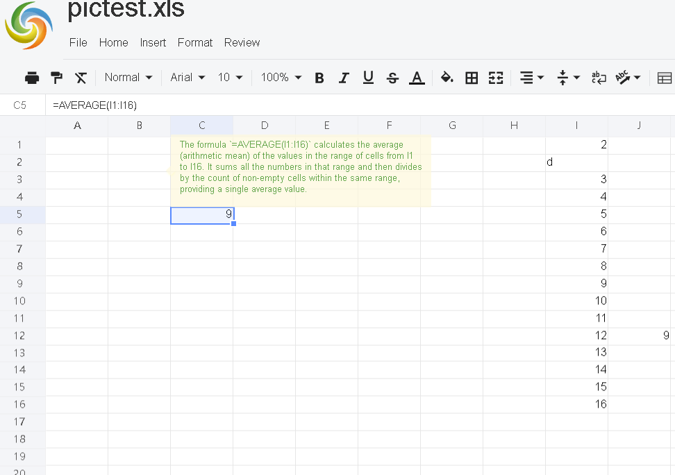

# To display formula explanation when hovering over a specific cell that contains a formula, the steps are

## Set load options.

For example:

```javascript
 const option = {
     ...
     //set showFormulaExplain to true
    showFormulaExplain:true,
 };
  xs = x_spreadsheet('#gridjs-demo', option)
```

## Set action URL for showFormulaExplain.

For example:

```javascript
    const formulaExplainUrl = "/GridJs2/FormulaExplain";
    xs.setFormulaExplainUrl(formulaExplainUrl);
```

When the user moves the mouse over a cell that contains a formula, the action of displaying the formula explanation will be triggered automatically by the spreadsheet application.

## Implement show formula explanation on the server side.

For example:

```python
# The logic for formula explanation here can be implemented through a third‑party library or custom logic.
# Implement your logic to get the detailed explanation for the formula
def get_formula_explain(formula, locale):  
    # Replace your logic here     
    return text  
  
@app.route('/GridJs2/FormulaExplain', methods=['POST'])  
def formula_explain():  
    formula = request.form.get('v')  
    locale = request.form.get('locale')  
    # Here the formula is the formula in the cell, e.g., "=SUM(B1:B10)"
    # Check if the formula is null or empty  
    if not formula:  
        return jsonify({  
            'Success': False,  
            'v': ''  
        }), 200  
      
    formula_explain = get_formula_explain(formula, locale)  
      
    return jsonify({  
        'Success': True,  
        'v': formula_explain  
    }), 200  
```


