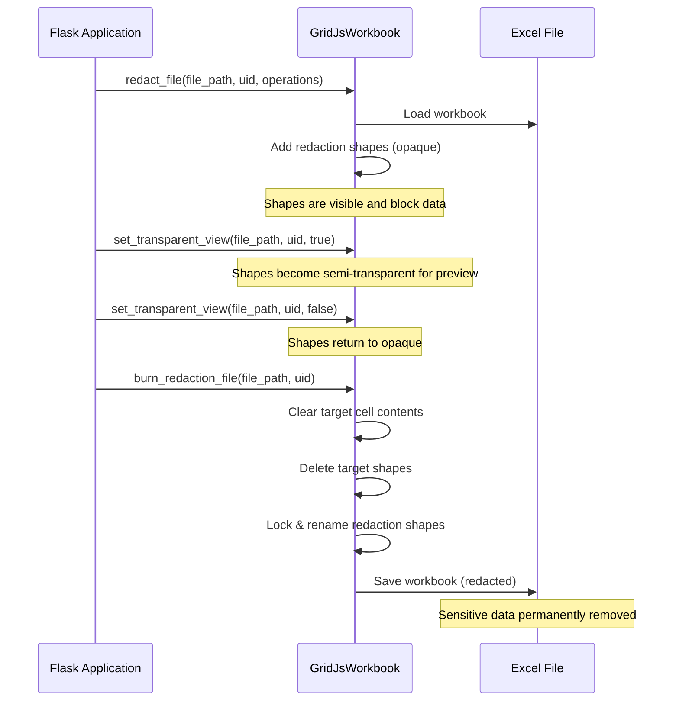

---  
title: How to Use Redaction Feature in GridJs  
type: docs  
weight: 260  
url: /python/aspose-cells-gridjs/how-to-use-redaction/  
description: This article explains how to apply redaction overlays on sensitive content in GridJs, covering client‑side CRUD operations, batch synchronization, and server‑side processing with Aspose.Cells.GridJs.  
keywords: GridJs,redaction,obscuring,blackout,redact,mask,masking,cover up,expunge,anonymize,desensitize,scrub,cover,redaction API,redaction overlay  
aliases:  
  - /python/aspose-cells-gridjs/redaction/  
  - /python/aspose-cells-gridjs/how-to-redact/  
  - /python/aspose-cells-gridjs/how-to-blackout/  
  - /python/aspose-cells-gridjs/apply-mask/  
  - /python/aspose-cells-gridjs/how-to-coverup/  
  - /python/aspose-cells-gridjs/apply-redaction/  
ai_search_scope: cells_python  
ai_search_endpoint: "https://docsearch.api.aspose.cloud/ask"  
---  

# Introduction  

The **Redaction** feature lets you hide sensitive information in a spreadsheet by drawing obscuring overlays on **cell ranges** or **shape/image objects**.  
All client‑side operations are asynchronous, and a set of server‑side APIs is provided to permanently apply (burn) the redactions.

This guide shows:

* How to create, update, delete and batch‑synchronize redactions from Python.  
* How to listen to redaction‑related events.  
* How to finalize redactions on the server using **Aspose.Cells.GridJs** for Python via .NET (`aspose.cellsgridjs`).  

---  

## Flask Application Setup (Python equivalent of `Startup.cs`)

```python
# app/__init__.py
from flask import Flask, render_template, request, jsonify
from aspose.cellsgridjs import GridJsWorkbook   # Python‑via‑.NET wrapper
import os

def create_app():
    """Application factory – configures Flask, registers blueprints, and
    prepares Aspose.Cells services."""
    app = Flask(__name__, instance_relative_config=True)

    # Load configuration (mirrors appsettings.json)
    app.config.from_pyfile('config.py', silent=True)
    app.config.from_mapping(
        SECRET_KEY=os.getenv('SECRET_KEY', 'dev'),
        UPLOAD_FOLDER=os.getenv('UPLOAD_FOLDER', '/tmp')
    )

    # Register routes (blueprints could be used for larger projects)
    @app.route('/')
    def index():
        # Render a page that loads the GridJs JavaScript component
        return render_template('gridjs.html')

    @app.route('/gridjs2/updatecell', methods=['POST'])
    def update_cell():
        """
        Endpoint that receives cell‑update payloads from the client.
        The body is JSON; you can process it or forward it to the workbook.
        """
        payload = request.get_json()
        # TODO: apply changes to the workbook if needed
        return jsonify({'status': 'ok', 'payload': payload})

    @app.route('/gridjs2/syncredaction', methods=['POST'])
    def sync_redaction():
        """
        Receives redaction synchronization data from the client.
        If `sync_to_server` flag is true, the payload is persisted using
        GridJsWorkbook.
        """
        data = request.get_json()
        operations = data.get('operations', [])
        sync_to_server = data.get('syncToServer', False)

        if sync_to_server:
            # Example of using Aspose.Cells.GridJs to apply the operations
            workbook_path = os.path.join(app.config['UPLOAD_FOLDER'], 'Confidential.xlsx')
            uid = 'doc-2024-04-27.xlsx'

            wb = GridJsWorkbook()
            # `operations` is expected to be a list of JSON strings
            wb.redact_file(workbook_path, uid, operations)

        return jsonify({'status': 'synced', 'received': len(operations)})

    # Middleware‑style hooks (Flask equivalents of before/after request)
    @app.before_request
    def before():
        # Example: start a request timer, validate API keys, etc.
        pass

    @app.after_request
    def after(response):
        # Example: add CORS headers, log request duration, etc.
        return response

    return app
```

> **Note** – The Flask app is *lazy‑loaded*; no global `app` object is created.  
> Use `if __name__ == '__main__':` **only** to run the development server:

```python
# run.py
from app import create_app

if __name__ == '__main__':
    create_app().run(debug=True)
```

---  

## Client‑Side API Overview (Pythonic usage)

Although the interactive GridJs component runs in the browser (JavaScript), the
Python back‑end can **prepare** the configuration object and **consume** the
asynchronous calls made by the component.  
Below are Python equivalents that illustrate how you would build the same
logic on the server side or within a Python‑driven automation script.

### Enable the feature  

```python
# gridjs_config.py – Python representation of the JavaScript options
gridjs_options = {
    # other options you may already use
    "updateMode": "server",
    "updateUrl": "/gridjs2/updatecell",
    "mode": "edit",
    "locale": "en",                     # default UI language
    "enableRedactionShape": True,       # <<< enables the feature
    "redactionDefaultColor": "green",   # optional – default colour
    "redactionReasons": [
        "Personal Information",
        "Confidential",
        "Legal Privilege",
        "Trade Secret",
    ],
}
```

The template (`templates/gridjs.html`) would embed this dictionary into the
client script:

```html
<script type="module">
import { x_spreadsheet } from '/static/js/gridjs.min.js';
const options = {{ gridjs_options|tojson }};
const xs = x_spreadsheet('#gridjs-demo-div', options);
</script>
```

All GridJs redaction APIs are **asynchronous** on the client; the Python server
receives the corresponding HTTP requests (see routes above).

---  

## API Reference (Python equivalents)

### 1. `insert_redaction_for_shape(reason, color, target_id, sheet_name=None)`

```python
async def insert_redaction_for_shape(xs, reason: str, color: str,
                                    target_id: str, sheet_name: str = None):
    """
    Adds a redaction overlay on a shape or image.
    """
    await xs.insertRedactionForShape(reason, color, target_id, sheet_name)

# Usage example (called from an async context, e.g., a WebSocket handler)
# await insert_redaction_for_shape(xs, 'Confidential', '#000000', '1')
# await insert_redaction_for_shape(xs, 'Privacy Data', 'gray', '2', 'Sheet2')
```

### 2. `insert_redaction_for_range(reason, color, range_dict, sheet_name=None)`

```python
async def insert_redaction_for_range(xs, reason: str, color: str,
                                    range_dict: dict, sheet_name: str = None):
    """
    Adds a redaction overlay on a cell range.
    `range_dict` must contain: sri, sci, eri, eci (0‑based indices).
    """
    await xs.insertRedactionForRange(reason, color, range_dict, sheet_name)

# Example
await insert_redaction_for_range(
    xs,
    'Confidential',
    '#000000',
    {"sri": 1, "sci": 1, "eri": 4, "eci": 3}
)

await insert_redaction_for_range(
    xs,
    'PII',
    '#333333',
    {"sri": 0, "sci": 0, "eri": 0, "eci": 0},
    'Sheet1'
)
```

### 3. `remove_redaction(redaction_id, sheet_name=None)`

```python
async def remove_redaction(xs, redaction_id: str, sheet_name: str = None):
    await xs.removeRedaction(redaction_id, sheet_name)

# await remove_redaction(xs, '42')
# await remove_redaction(xs, '42', 'Sheet2')
```

### 4. `sync_redaction_operations(history_opr_array, sync_to_server)`

```python
async def sync_redaction_operations(xs, history_opr_array: list, sync_to_server: bool):
    """
    Sends a batch of redaction operations to the server.
    `history_opr_array` follows the same schema as the JavaScript example.
    """
    await xs.syncRedactionOprClient(history_opr_array, sync_to_server)

# Sample payload (trimmed for brevity)
operations = [
    {
        "name": "Sheet2",
        "op": "syncRedactionSingle",
        "subopr": "add",
        "shape": {
            "id": 9, "left": 144, "top": 304, "width": 95, "height": 69,
            "angle": 0, "zorder": 7, "type": "Rectangle", "bgColor": "green",
            "isRedaction": True,
            "redactionReason": "PII - Personal Information",
            "name": "aspose.redaction-1776848316091208-4",
            "isNewAdded": True,
            "fontSetting": {"size": 12.75, "color": "#FFFFFF",
                            "name": "sans-serif", "bold": False, "italic": False}
        }
    },
    # … additional records …
]

await sync_redaction_operations(xs, operations, sync_to_server=True)
```

### 5. `burn_all_redactions()`

```python
async def burn_all_redactions(xs):
    await xs.burnAllRedactions()

# await burn_all_redactions(xs)
```

---  

## Redaction‑Related Events (Python Flask‑side handling)

While the events are emitted in the browser (`xs.on(event, handler)`), you can
forward them to the Flask back‑end using `fetch`/`XMLHttpRequest`.  
Below is a **Python Flask endpoint** that would receive those callbacks:

```python
@app.route('/gridjs2/event', methods=['POST'])
def gridjs_event():
    """
    Generic endpoint that receives any GridJs event payload.
    The client should POST JSON like:
    { "event": "redaction-inserted", "payload": {...} }
    """
    data = request.get_json()
    event = data.get('event')
    payload = data.get('payload')

    # Simple logging – replace with real handling as needed
    app.logger.info(f"Received GridJs event: {event} – {payload}")

    return jsonify({'status': 'received'})
```

In the client script you would forward the event:

```javascript
xs.on('redaction-inserted', (sheetName, redactionData) => {
    fetch('/gridjs2/event', {
        method: 'POST',
        headers: {'Content-Type': 'application/json'},
        body: JSON.stringify({
            event: 'redaction-inserted',
            payload: {sheetName, redactionData}
        })
    });
});
```

---  

## General Usage – Enumerating Existing Redactions (Python)

```python
import asyncio

async def count_redactions(xs_instance) -> int:
    """
    Visits every loaded sheet and counts visible redaction shapes.
    Returns the total number of active redactions.
    """
    if not xs_instance or not getattr(xs_instance, 'datas', None):
        return 0

    total = 0
    for sheet_data in xs_instance.datas:
        # Ensure the sheet is loaded before accessing its shapes
        await xs_instance.loadSheetDataLazily(sheet_data)
        if not sheet_data.shapes:
            continue

        for shape in sheet_data.shapes:
            # Skip deleted records (shape.op === 'del')
            if shape.isRedaction and (not getattr(shape, 'op', None) or shape.op != 'del'):
                print('Found redaction:', shape)
                if getattr(shape, 'targetId', None):
                    print(' → Applied to shape/image ID:', shape.targetId)
                else:
                    print(' → Applied to cell range:', getattr(shape, 'targetCellRange', None))
                total += 1
    return total

# Example usage within an async context
# total = asyncio.run(count_redactions(xs))
# print(f'Total active redactions: {total}')
```

---  

## Row/Column Index Reference  

| Index | Column | Example `range` object |
|-------|--------|------------------------|
| 0 | A | `{ "sri": 0, "sci": 0, "eri": 0, "eci": 0 }` → A1 |
| 1 | B | `{ "sri": 1, "sci": 1, "eri": 3, "eci": 2 }` → B2:D3 |
| 2 | C | … |
| 3 | D | … |
| … | … | … |

---  

## Server‑Side API (Python) – Aspose.Cells `GridJsWorkbook`

The **Aspose.Cells.GridJs** library for Python (via .NET) provides the same
functionality as the C# examples. All calls are synchronous in Python, but you
can wrap them in `asyncio.to_thread` if you need non‑blocking behaviour.

### 1. `redact_file`

```python
from aspose.cellsgridjs import GridJsWorkbook
import os

def apply_redaction():
    # Initialise the GridJs workbook helper
    workbook = GridJsWorkbook()

    # Path to the source Excel file
    excel_file_path = os.path.join('Data', 'Confidential.xlsx')

    # Unique identifier for the workbook (used for caching)
    uid = 'doc-2024-04-27.xlsx'

    # JSON strings that describe each redaction operation.
    # Normally you would receive these from the client (xs.syncRedactionOprClient(...))
    redaction_operations = [
        # Redaction over a cell range
        """{
            "op":"syncRedactionSingle","name":"Sheet1","subopr":"add",
            "shape":{"id":1,"left":100,"top":200,"width":120,"height":30,
                     "type":"Rectangle","bgColor":"#FF0000",
                     "isRedaction":true,"redactionReason":"PII",
                     "name":"aspose.redaction-1-0.0.4.2"}
        }""",
        # Redaction over a shape with target ID 7
        """{
            "op":"syncRedactionSingle","name":"Sheet2","subopr":"add",
            "shape":{"id":2,"left":300,"top":150,"width":80,"height":80,
                     "type":"Rectangle","bgColor":"#000000",
                     "isRedaction":true,"redactionReason":"Confidential",
                     "name":"aspose.redaction-2-7"}
        }"""
    ]

    # Apply the redactions – any failure throws an exception that contains the offending JSON
    workbook.redact_file(excel_file_path, uid, redaction_operations)

    # Optionally save the modified workbook
    workbook.save_to_xlsx(os.path.join('Output', 'redact_output.xlsx'))

# apply_redaction()
```

#### Exceptions  

| Exception | When it is thrown |
|-----------|-------------------|
| `GridCellException` | A low‑level Cells exception occurs while processing a redaction operation. |
| `Exception` | Any other error (e.g., invalid JSON, missing sheet). The message includes the JSON that caused the failure. |

### 2. `set_transparent_view`

```python
def toggle_transparency(make_transparent: bool):
    workbook = GridJsWorkbook()
    excel_path = os.path.join('Data', 'Confidential.xlsx')
    uid = 'doc-2024-04-27.xlsx'

    # true  → 0.89 opacity (semi‑transparent)  
    # false → 0.0  opacity (fully opaque)
    workbook.set_transparent_view(excel_path, uid, make_transparent)

    # Save a preview file if you wish
    suffix = 'preview' if make_transparent else 'opaque'
    workbook.save_to_xlsx(os.path.join('Output', f'redact_{suffix}.xlsx'))

# toggle_transparency(True)   # preview
# toggle_transparency(False)  # back to opaque
```

### 3. `burn_redaction_file`

```python
def burn_redactions():
    workbook = GridJsWorkbook()
    excel_path = os.path.join('Data', 'Confidential.xlsx')
    uid = 'doc-2024-04-27.xlsx'

    # WARNING: This operation is irreversible!
    workbook.burn_redaction_file(excel_path, uid)

    # Save the final redacted workbook
    workbook.save_to_xlsx(os.path.join('Output', 'redact_burned.xlsx'))

# burn_redactions()
```

---  

## Typical Redaction Workflow (Python)



### Step‑by‑Step Python Sample  

```python
import os
from aspose.cellsgridjs import GridJsWorkbook

def redaction_demo():
    workbook = GridJsWorkbook()

    file_path = os.path.join('Data', 'Confidential.xlsx')
    uid = 'demo-2024-04-27.xlsx'

    # 1️⃣ Apply redactions (add shapes)
    ops = [
        # Redact SSN column (cells B2:B100)
        """{
            "op":"syncRedactionSingle","name":"Sheet1","subopr":"add",
            "shape":{"id":10,"left":120,"top":200,"width":30,"height":4000,
                     "type":"Rectangle","bgColor":"#000000",
                     "isRedaction":true,"redactionReason":"SSN",
                     "name":"aspose.redaction-10-1.1.99.1"}
        }""",
        # Redact a confidential image (target shape ID = 25)
        """{
            "op":"syncRedactionSingle","name":"Sheet1","subopr":"add",
            "shape":{"id":11,"left":500,"top":300,"width":150,"height":100,
                     "type":"Rectangle","bgColor":"#444444",
                     "isRedaction":true,"redactionReason":"Confidential Image",
                     "name":"aspose.redaction-11-25"}
        }"""
    ]
    workbook.redact_file(file_path, uid, ops)
    workbook.save_to_xlsx(os.path.join('Output', 'redact_output.xlsx'))

    # 2️⃣ Preview – make shapes semi‑transparent
    workbook = GridJsWorkbook()
    workbook.set_transparent_view(os.path.join('Output', 'redact_output.xlsx'), uid, True)
    workbook.save_to_xlsx(os.path.join('Output', 'redact_preview.xlsx'))

    # 3️⃣ Return to opaque (if user wants to re‑view)
    workbook = GridJsWorkbook()
    workbook.set_transparent_view(os.path.join('Output', 'redact_output.xlsx'), uid, False)
    workbook.save_to_xlsx(os.path.join('Output', 'redact_opaque.xlsx'))

    # 4️⃣ Burn – permanently remove covered data and shapes
    workbook = GridJsWorkbook()
    workbook.burn_redaction_file(os.path.join('Output', 'redact_output.xlsx'), uid)
    workbook.save_to_xlsx(os.path.join('Output', 'redact_burned.xlsx'))

if __name__ == '__main__':
    redaction_demo()
```

> **Important** – After burning, the workbook’s sheets are protected at the **object** level; redaction shapes cannot be moved or deleted without first removing the protection.

---  

## Summary  

* **Client side** – Use the GridJs JavaScript component (options shown in
  `gridjs_options`) to insert, update, delete, synchronize, and finally burn
  redactions. Forward the asynchronous calls to Flask endpoints (`/gridjs2/*`).  
* **Events** – Capture redaction‑related events in the browser and POST them to
  Flask (`/gridjs2/event`) for server‑side logging or additional processing.  
* **Server side (Python)** – Leverage `aspose.cellsgridjs.GridJsWorkbook` to:
  * Apply redactions (`redact_file`)  
  * Preview with semi‑transparent shapes (`set_transparent_view`)  
  * Permanently erase data (`burn_redaction_file`)  

By following this Python‑centric workflow, you can safely obscure sensitive
spreadsheet data during collaborative editing and guarantee its permanent
removal when the document is finalized.  