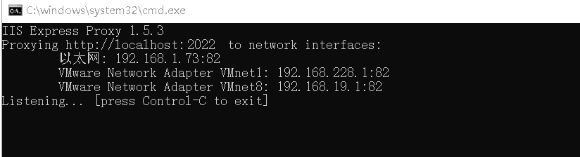
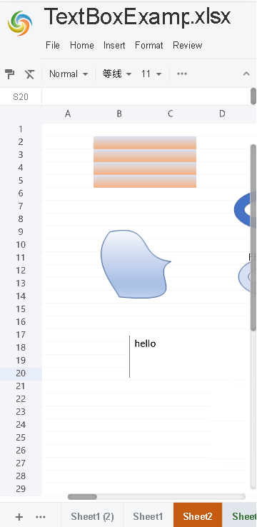

## Use GridJs in mobile device

You can use GridJs smoothly on the mobile device. 

GridJs can adapts the mobile screen.

Run the [demo of GridJs ](https://github.com/aspose-cells/Aspose.Cells.Grid-for-Python-via-.NET/tree/main/Examples.GridJs "demo of GridJs ")

You need to access the page through IP way on the mobile terminal http://127.0.0.1:2022 . 

You can use a small tool like: iisexpress proxy.

Install with the following command:

*npm install -g iisexpress-proxy*

Run the command to complete the port mapping:

*iisexpress-proxy 2022 to 82*

Then  we can open the demo web page in the mobile browser.

Navigate the page http://yourip:82/ .

Then we can do edit operations as in PC device.