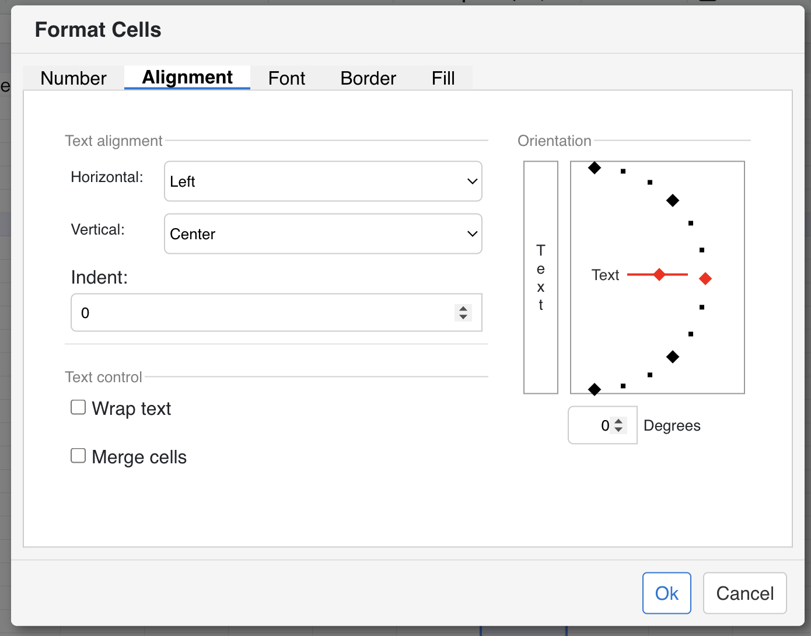

## Overview
Aspose.Cells GridJs provides a **Text Rotate** button on the toolbar. Through its dropdown you can choose common rotation styles or specify a custom angle. The chosen rotation is applied immediately to the currently selected cell or range.

## UI Operations
1. **Open the rotation menu**  
   Click the **Text Rotate** button on the toolbar. The dropdown opens, showing a list of rotation options.  
   
2. **Select a predefined rotation**  
   Choose one of the following options:  
   - **Vertical Text**  
   - **Angle‑Clockwise**  
   - **Angle‑Counter‑Clockwise**  
   - **Rotate Text Up**  
   - **Rotate Text Down**  
   The dropdown title updates to reflect the selection and then closes. The rotation is applied to the selected cells.  

   

3. **Apply a custom angle**  
   Choose **Other Angle**. A modal dialog appears where you can type any angle between **‑90° and 90°**. Click **OK** to apply or **Cancel** to dismiss.  

   

## Options & Alerts
- **Predefined angles** give quick access to the most common orientations.  
- **Custom angle** lets you fine‑tune the rotation; entering a value outside the ‑90 → 90 range will be rejected by the UI.  
- The selected rotation remains active in the toolbar dropdown, so subsequent cell selections will use the same orientation until you change it again.

## JavaScript API
text rotation changes can be achieved by setting the `textRotate` attribute on a cell or range using the `setRangeAttr` method of the `data` object. After updating the attribute, call the `render` method to apply the changes visually.

```js
// Assume xs is your x_spreadsheet instance
xs = x_spreadsheet('#gridjs-demo-uid', option);
const range = {"sri":2,"sci":2,"eri":2,"eci":2}; // Define the cell range (row/col indices)
// Set the text rotation of a specific cell or range
xs.sheet.data.setRangeAttr(range, 'textRotate', "45");
// Render the changes to update the UI
xs.sheet.table.render();
```


### Relevant functions 

| Function | Description | Parameters | Returns |
|----------|-------------|------------|---------|
| `xs.sheet.data.setRangeAttr(range, attr, value)` | Modifies an attribute of the currently selected range. For text rotation, set `attr` to `'textRotate'` and `value` to the desired angle in degrees (e.g., `"45"`). | `range` – **object** (contains `sri`, `sci`, `eri`, `eci` for start/end row/column).<br>`attr` – **string** (`'textRotate'` only).<br>`value` – **string** (angle in degrees). | `undefined` (grid refreshes automatically). |
| `xs.sheet.table.render()` | Re-renders the table UI to reflect any data or style changes. | None. | `undefined`. |

## Tips
- **Select cells first** – Rotation always applies to the active cell or range, so make your selection before opening the dropdown.  
- **Keep the dropdown open** – After applying a rotation, the dropdown stays in the chosen state, allowing rapid changes across multiple selections.  