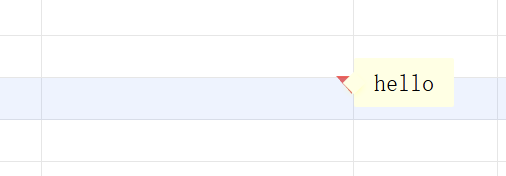

———
title: How to use Comment
description: Add, edit, remove, and navigate cell comments, with a marker on the cell and a hover tip showing the note.
keywords: Comment, Edit comment, Remove comment, Previous comment, Next comment, insertComment, newComment, comments
type: docs
weight: 1
url: /python-net/aspose-cells-gridjs/how-to-comment
aliases:

- /python-net/aspose-cells-gridjs/how-to-use-comment
- /python-net/aspose-cells-gridjs/how-to-add-comment
- /python-net/aspose-cells-gridjs/how-to-edit-comment
- /python-net/aspose-cells-gridjs/how-to-remove-comment
- /python-net/aspose-cells-gridjs/how-to-navigate-comments
———

## Introduction

Comments are stored per cell and rendered as an indicator on the cell's top-right corner. Hovering a commented cell shows a
comment tip with the note content, and opening Comment displays an inline editor prefilled with the existing note.
Previous/Next comment moves to the nearest earlier or later comment by row and column order. In collaborative mode, comment
changes are sent to the server.

## How to use

1. Select a cell, right-click to open the context menu, then choose Comment.

2. Or open the Insert menu and click Comment to start editing the selected cell.

3. Enter text in the editor (placeholder: "Please enter text"), then click outside the editor to save. The cell shows a
comment marker after saving.

4. Open the Review menu to use Edit comment, Remove comment, Previous comment, or Next comment.
5. Hover a commented cell to display the comment tip.

## JavaScript API

xs = x_spreadsheet('#gridjs-demo-uid', option);

// Add or update a comment.
xs.sheet.setComment(ri, ci, 'Aspose', 'Comment text');

// Remove a comment.
xs.sheet.removeComment(ri, ci);

### Relevant functions

| Function | Description | Parameters | Returns |
|----------|-------------|------------|---------|
| sheet.setComment(ri, ci, author, note) | Add or update a comment on the target cell. If note is empty (or empty HTML), the comment is removed. If note is non-empty and not wrapped in a  tag, the note is sanitized and wrapped with a default font style. | ri (row index), ci (column index), author (string), note (HTML string) | void |
| sheet.removeComment(ri, ci) | Remove the comment from the target cell. | ri (row index), ci (column index) | void |

sheet.setComment(...) updates the comment entry for the target cell, and removes it when the note is empty.
sheet.removeComment(...) clears the comment for the target cell.

## Common Questions

Q: Why did my comment disappear after saving?
A: If the note is empty or considered empty HTML, the comment is removed.

Q: How do Previous comment and Next comment choose the target?
A: Comments are sorted by row and column; Previous chooses the nearest earlier comment and Next chooses the nearest later
comment.

Q: Where do comments show in the UI?
A: A marker is drawn on the cell's top-right corner, and hovering the cell shows a comment tip.
