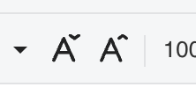

## Introduction

GridJs provides two toolbar buttons for changing the font size step by step: **Increase font size** and **Decrease font size**. The toolbar creates these buttons with `FontSizeIncrease` and `FontSizeDecrease`.

When a user clicks one of these buttons, GridJs reads the current selected cell font size, finds the next larger or smaller value in the `fontSizes` list, and writes that value back to the selected cells as `font-size`.

## How to use

1. Select the cell or range whose font size you want to change.

   GridJs applies the command to the current selected range through `data.setSelectedCellAttr`.

2. Click the **Increase font size** toolbar button.

   The button uses the `increase-font-size` icon and emits the `font-size-increase` command.

3. Click the **Decrease font size** toolbar button.

   The button uses the `decrease-font-size` icon and emits the `font-size-decrease` command.

4. Review the updated font size on the selected cells.

   The sheet handler gets the current selected font size, calls `getSteppedFontSize`, and applies the returned point size through `data.setSelectedCellAttr('font-size', nextSize)`.

5. Use the font size dropdown when you need to choose an exact listed size.

   The `FontSize` dropdown uses the same `fontSizes` list and sends a direct `font-size` value, while the increase and decrease buttons move one step at a time through that list.

## JavaScript API

The inspected code implements font size increase and decrease through internal toolbar commands. It does not expose a separate public JavaScript method dedicated only to increasing or decreasing font size.

### Relevant functions
| Function / Location | Description | Parameters | Returns |
|----------|-------------|------------|---------|
| `FontSizeIncrease` (`component/toolbar/font_size_increase.js`) | Creates the toolbar item with tag `increase-font-size` and emits `font-size-increase` when clicked. | None | `FontSizeIncrease` instance |
| `FontSizeDecrease` (`component/toolbar/font_size_decrease.js`) | Creates the toolbar item with tag `decrease-font-size` and emits `font-size-decrease` when clicked. | None | `FontSizeDecrease` instance |
| `Toolbar` constructor (`component/toolbar/index.js`) | Adds `FontSize`, `FontSizeDecrease`, and `FontSizeIncrease` to the toolbar font group. | `data`, `widthFn`, `isHide`, `showPartToolbar` | `Toolbar` instance |
| Toolbar change handler (`component/sheet.js`) | Handles `font-size-increase` and `font-size-decrease`, calculates the next size, applies `font-size`, and resets the sheet. | `type`, `value`, optional `callback` | `void` |
| `getCurrentFontSizeFromSelection(data)` (`component/sheet.js`) | Reads the selected cell font size, falls back to the default style font size, then falls back to the first `fontSizes` point value or `10`. | `data` | number |
| `getSteppedFontSize(currentSize, isIncrease)` (`component/sheet.js`) | Returns the next larger point size when increasing, the next smaller point size when decreasing, and clamps to the first or last listed size. | `currentSize`, `isIncrease` | number |
| `setSelectedCellAttr(property, value)` (`core/data_proxy.js`) | Applies `font-size` by setting `cstyle.font.size` to the provided value for each selected cell. | `property`, `value` | `void` |
| `fontSizes` (`core/font.js`) | Provides the point-size steps used by the dropdown and by the increase/decrease logic. | None | Array of `{ pt, px }` |
| `DropdownFontSize` (`component/dropdown_fontsize.js`) | Builds the font size dropdown from `fontSizes` and emits the selected item. | None | `DropdownFontSize` instance |

## Common Questions

Q: Which size values do the increase and decrease buttons use?
A: They use the `pt` values from the `fontSizes` array in `core/font.js`.

Q: What happens when the selected cell does not have a font size?
A: GridJs falls back to the default style font size. If that is not a positive number, it falls back to the first `fontSizes` point value or `10`.

Q: What happens at the smallest or largest listed font size?
A: `getSteppedFontSize` clamps the result to the first listed size when decreasing below the minimum and to the last listed size when increasing above the maximum.

Q: Is the dropdown the same as the increase and decrease buttons?
A: No. The dropdown chooses a specific listed size, while the increase and decrease buttons move to the next larger or smaller listed size.
