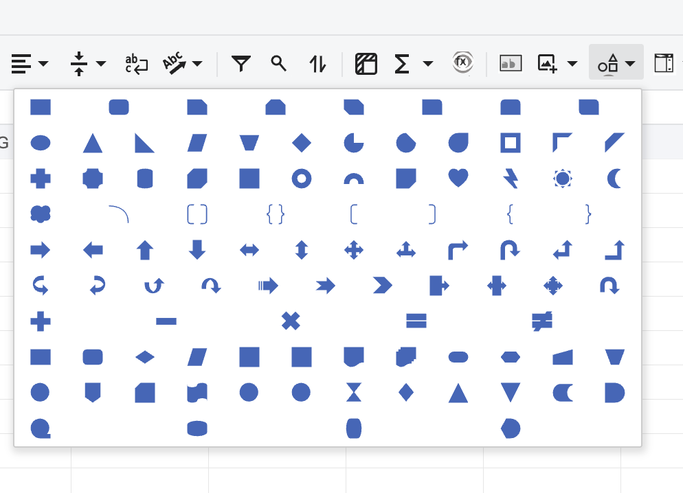

## Introduction

GridJs provides an **Insert Shapes** toolbar item through the `InsertShape` dropdown item. The dropdown renders shape buttons from `shapeSVG` and only keeps shape names that also exist in `AutoShapeType`.

When a shape is selected, GridJs opens a temporary Fabric canvas over the sheet. Users draw the selected shape by dragging on the worksheet area, and GridJs sends the selected shape type and drawn size through the same upload flow used by image insertion.

## How to use

1. Open a worksheet in GridJs.

   The toolbar creates the shape command as `insertShapeEL = new InsertShape()` in the insert tools group.

2. Click the **Insert Shapes** toolbar item.

   The toolbar item uses the `insert-shape` command tag and opens `DropdownInsertShape`.

3. Choose a shape from the dropdown.

   The dropdown displays SVG buttons from the rectangle, basic, block arrow, equation, and flowchart groups. A shape is shown only when its name exists in `AutoShapeType`.

4. Move the pointer over the worksheet and drag to draw the shape.

   After a shape is selected, `drawShape(svgString, shapeName)` creates a temporary canvas named `drawShapeCanvas`, sets the cursor to `crosshair`, and starts drawing the SVG shape on mouse down.
5. Release the mouse button.

   GridJs reads the drawn shape bounds, builds a shape info object with `name`, `left`, `top`, `w`, and `h`, and calls `paste.uploadImg(sheet, null, shapeInfo)`.

6. Review the inserted shape on the sheet.

   The upload flow sends the shape type and size to the configured image upload endpoint. When the server response returns shape data, GridJs inserts it through `canvas.doInsertImage`. Shape types listed in `AutoShapeType` are stored in `sheet.data.shapes`.

## JavaScript API

The inspected code does not expose a separate public JavaScript API dedicated only to inserting shapes. Shape insertion is implemented through the toolbar dropdown, `Sheet.drawShape`, and the image upload pipeline.

### Relevant functions
| Function / Location | Description | Parameters | Returns |
|----------|-------------|------------|---------|
| `InsertShape` (`component/toolbar/insert_shape.js`) | Defines the `insert-shape` dropdown toolbar item and returns `DropdownInsertShape`. | optional `value` | `InsertShape` instance |
| `DropdownInsertShape` (`component/dropdown_insert_shape.js`) | Builds SVG shape buttons from `shapeSVG`, filters them by `AutoShapeType`, and emits `{ svg, name }` when a shape is clicked. | None | `DropdownInsertShape` instance |
| `AutoShapeType` (`component/AutoShapeType.js`) | Provides the supported AutoShape type names and numeric values used to validate available shape buttons and classify inserted objects as shapes. | None | Object |
| Toolbar change handler (`component/sheet.js`) | Handles `type === "insert-shape"` and calls `this.drawShape(value.svg, value.name)`. | `type`, `value` from toolbar dropdown | `void` |
| `drawShape(svgString, shapeName)` (`component/sheet.js`) | Creates a temporary Fabric canvas, lets the user drag the selected SVG shape, and submits the drawn shape info when the mouse is released. | `svgString`, `shapeName` | `void` |
| `uploadImg(sheet, file, shapeInfo = {})` (`component/imageOperations/paste.js`) | Sends `uid` and JSON parameter `p`; for shape insertion it sets `p.type`, `p.w`, and `p.h` from `shapeInfo` and removes the image file field. | `sheet`, `file`, optional `shapeInfo` | `void` |
| `postImageReq(sheet, reqdata, cb)` (`component/imageOperations/paste.js`) | Posts the upload request to `sheet.imageUploadByLocalUrl` and calls the callback when the response has no error. | `sheet`, `reqdata`, `cb` | `void` |
| `doInsertImage(datar, sheet, isUrl = false)` (`component/image_canvas.js`) | Inserts the returned object into the canvas using the selected cell rectangle. | `datar`, `sheet`, optional `isUrl` | `void` |
| `doInsertImageInner(coords, datar, sheet, isUrl, raiseServerOpr, issamesheet)` (`component/image_canvas.js`) | Stores objects whose type exists in `AutoShapeType` in `sheet.data.shapes`. | `coords`, `datar`, `sheet`, `isUrl`, `raiseServerOpr`, `issamesheet` | `void` |
| `setImageInfo(url, upload1, upload2, copyUrl, zorder, loadinggifurl)` (`index.js`) | Sets image and shape upload endpoints, including `sheet.imageUploadByLocalUrl`, which shape insertion uses. | `url`, `upload1`, `upload2`, `copyUrl`, `zorder`, optional `loadinggifurl` | `void` |

## Common Questions

Q: Which shapes are visible in the dropdown?
A: The dropdown renders shapes from `shapeSVG` only when the shape name exists in `AutoShapeType`. The inspected dropdown adds rectangle, basic, block arrow, equation, and flowchart groups to the menu.

Q: Are line shapes shown by this dropdown?
A: The inspected code creates `linesButtons`, but the line group is not pushed into the final `buttonGroups` array.

Q: How does GridJs know the selected shape type?
A: The dropdown emits the selected shape name, and `drawShape` passes that name as `shapeInfo.name`. `uploadImg` sends it as `p.type`.

Q: Where is the inserted shape stored?
A: After the server response is inserted, `doInsertImageInner` stores objects whose type exists in `AutoShapeType` in `sheet.data.shapes`.
