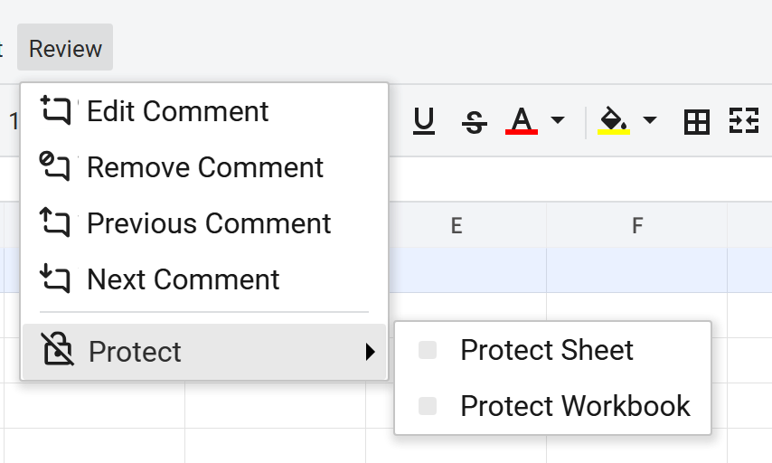
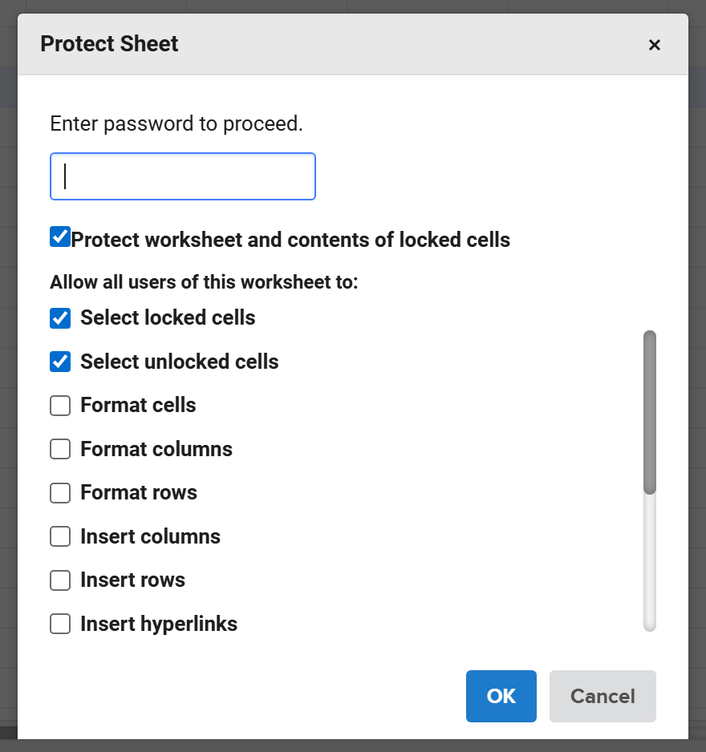
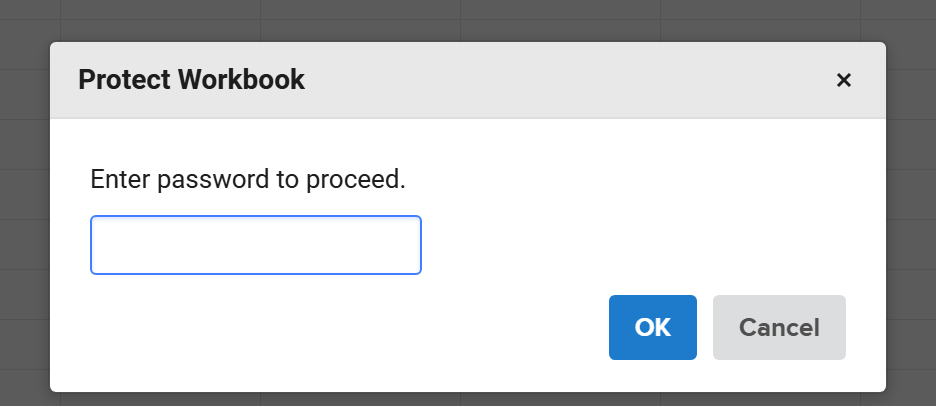
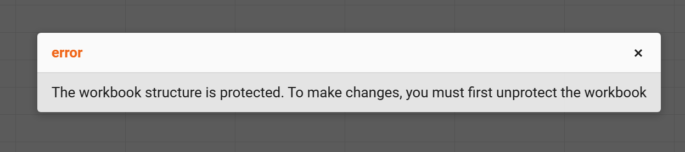

## Introduction

GridJs provides a Protect menu with separate actions for **Protect Sheet** and **Protect Workbook**. Protect Sheet opens a password dialog that can also collect worksheet permission options such as selecting locked cells, sorting, or using AutoFilter. Protect Workbook applies workbook-structure protection, and the code blocks sheet add, delete, and rename actions while workbook protection is active.

## How to use

1. Open the **Protect** menu in the toolbar, then choose **Protect Sheet** or **Protect Workbook**.


2. To protect a sheet, enter a password in the **Protect Sheet** dialog. Leave **Protect worksheet and contents of locked cells** checked if you want locked cells to stay protected, then choose any allowed actions such as **Select locked cells**, **Select unlocked cells**, **Format cells**, **Insert rows**, **Sort**, or **Use AutoFilter**.


3. Reenter the same password in the confirmation dialog. If the two passwords do not match, GridJs shows an error and asks again.

4. To protect the workbook structure, choose **Protect Workbook**, enter a password, and confirm it. This dialog only asks for the password and confirmation.


5. To remove protection, open the same Protect menu item again. GridJs asks for the password to unprotect the sheet or workbook, and it shows an **Incorrect password** error if the password is wrong.

6. After protection is applied, workbook protection blocks sheet structure changes such as adding, deleting, or renaming worksheets, and sheet protection blocks changes to locked cells or other protected areas.


## JavaScript API

```js
xs = x_spreadsheet('#gridjs-demo-uid', option);

// Protect the current sheet and allow a few actions.
xs.sheet.data.protectSheetOpr('secret', {
  canselectlocked: true,
  canselectunlocked: true,
  allowSort: true,
  allowFilter: true,
  allowFormatCell: false,
  allowInsertRow: false,
});

// Remove sheet protection.
xs.sheet.data.unprotectSheetOpr('secret');

// Protect workbook structure.
xs.sheet.data.protectWorkbookOpr('secret');

// Remove workbook structure protection.
xs.sheet.data.unprotectWorkbookOpr('secret');
```

### Relevant functions
| Function | Description | Parameters | Returns |
|----------|-------------|------------|---------|
| `sheet.data.protectSheetOpr(password, protection)` | Sends a `protectsheet` operation for the current sheet and can include worksheet permission flags. | `password` (string), `protection` (object, optional) | `void` |
| `sheet.data.unprotectSheetOpr(password)` | Sends an `unprotectsheet` operation for the current sheet. | `password` (string, optional) | `void` |
| `sheet.data.protectWorkbookOpr(password)` | Sends a `protectworkbook` operation for workbook structure protection. | `password` (string) | `void` |
| `sheet.data.unprotectWorkbookOpr(password)` | Sends an `unprotectworkbook` operation for workbook structure protection. | `password` (string, optional) | `void` |

The `protection` object used by `protectSheetOpr` can include keys exposed in the dialog, including `canselectlocked`, `canselectunlocked`, `allowFormatCell`, `allowFormatCol`, `allowFormatRow`, `allowInsertCol`, `allowInsertRow`, `allowInsertLink`, `allowDeleteCol`, `allowDeleteRow`, `allowEditObject`, `allowEditScenario`, `allowSort`, `allowFilter`, and `allowUsePivot`.

## Common Questions

Q: What is the difference between Protect Sheet and Protect Workbook?
A: Protect Sheet applies password-based protection to the current worksheet and can include per-action permissions. Protect Workbook applies workbook structure protection and blocks sheet add, delete, and rename actions.

Q: What happens if I enter the wrong password when unprotecting?
A: GridJs shows an **Incorrect password** error and prompts again for the password.

Q: Which actions can stay available on a protected sheet?
A: The sheet protection dialog exposes options including selecting locked or unlocked cells, formatting cells, columns, or rows, inserting rows, columns, or hyperlinks, deleting rows or columns, editing objects or scenarios, sorting, using AutoFilter, and using PivotTable or PivotChart.

Q: What happens to locked cells after sheet protection is turned on?
A: Changes to locked cells are blocked, and the code checks the sheet protection state together with each cell's locked or unlocked style.
