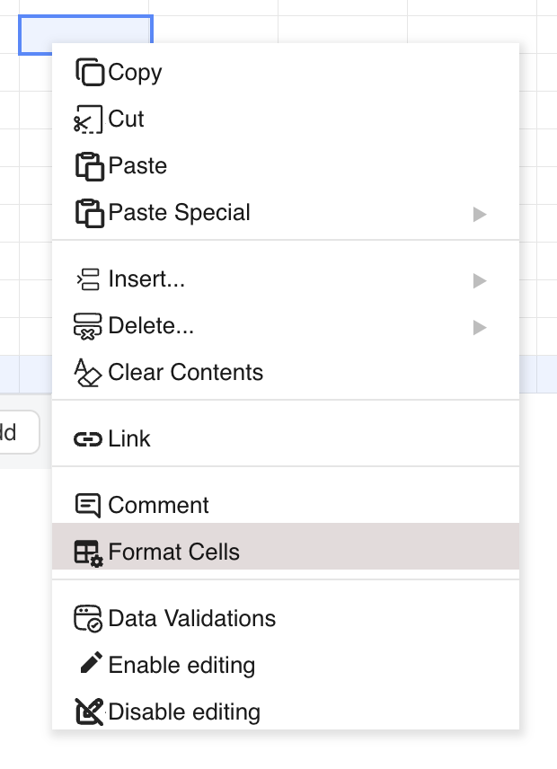
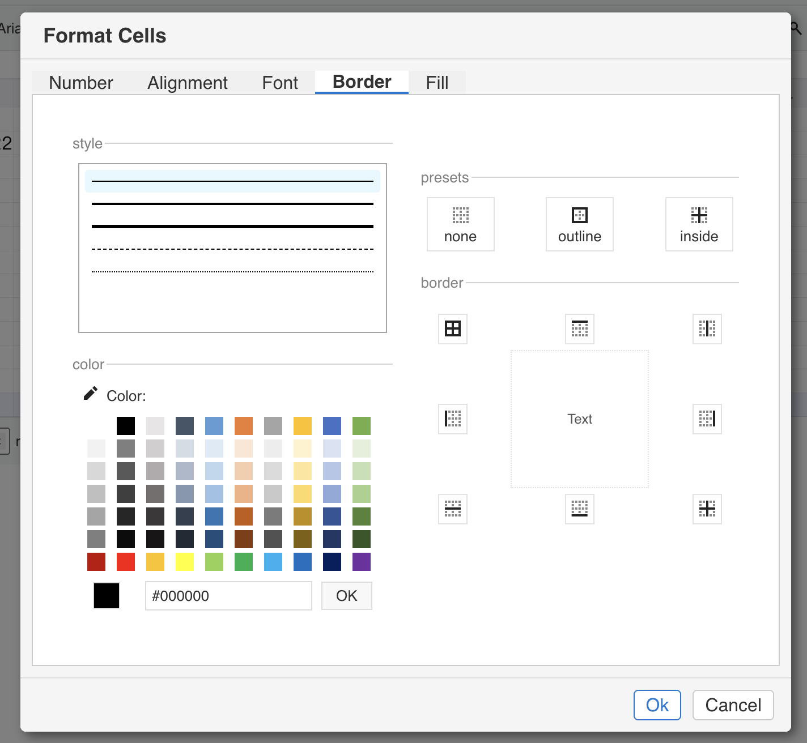

## Introduction

GridJs includes a **Format Cells** dialog with a **Border** tab. In that tab, you can choose one of the built-in line styles, pick a border color, use preset actions such as **none**, **outline**, and **inside**, or click individual border buttons around the preview area. The dialog keeps these changes in local border actions and applies them to the current selection only after you click **Ok**.

## How to use

1. Select the cell or range that you want to format.

2. Open the context menu and click **Format Cells**.


3. In the dialog, open the **Border** tab.

4. In the **style** section, choose one of the available line styles: `thin`, `medium`, `thick`, `dashed`, or `dotted`.

5. In the **color** section, pick the border color that you want to apply.

6. Use the preset buttons to remove all borders (`none`), apply an outer outline (`outline`), or apply inside borders (`inside`). When the current selection is a single cell, the **inside** preset is disabled.

7. If you need more control, use the preview buttons to toggle `top`, `bottom`, `left`, `right`, `all`, `horizontal`, `vertical`, or `inside` for the current selection.

8. Review the preview area. The preview uses up to a 2 x 2 layout from the current selection and highlights the border buttons that are currently active.

9. Click **Ok**. GridJs sends each recorded border action to the selected range and redraws the sheet with the new borders.



## JavaScript API

```js
const xs = x_spreadsheet('#gridjs-demo-uid', options);

// Apply an outside border to the current selection.
xs.sheet.data.setSelectedCellAttr('border', {
  mode: 'outside',
  style: 'thin',
  color: '#000000',
});

// Add inside borders to the current selection.
xs.sheet.data.setSelectedCellAttr('border', {
  mode: 'inside',
  style: 'dashed',
  color: '#ff0000',
});

// Read the resulting border object from a cell.
const border = xs.cellStyle(0, 0, 0).border;
```

### Relevant functions
| Function | Description | Parameters | Returns |
|----------|-------------|------------|---------|
| `sheet.data.setSelectedCellAttr(property, value)` | Applies a border action to the current selection immediately. | `property`: `'border'`; `value`: `{ mode, style, color }` | `void` |
| `sheet.data.setRangeAttr(range, property, value)` | Applies a border action to a specific range. The **Format Cells** dialog uses this path when you click **Ok**. | `range`: selected range; `property`: `'border'`; `value`: `{ mode, style, color }` | `void` |
| `cellStyle(rowIndex, colIndex, sheetIndex)` | Returns the cell style object for a cell. | `rowIndex`, `colIndex`, `sheetIndex` | `CellStyle` |

For border actions, the code handles these modes: `none`, `all`, `inside`, `outside`, `horizontal`, `vertical`, `top`, `bottom`, `left`, and `right`. The Border tab exposes these line styles in the UI: `thin`, `medium`, `thick`, `dashed`, and `dotted`.

The resulting border data is stored in `CellStyle.border`, where each side uses the shape `top?: [style, color]`, `right?: [style, color]`, `bottom?: [style, color]`, and `left?: [style, color]`.

## Common Questions

Q: When are border changes actually written to the sheet from the Border tab?
A: The Border tab records actions while you click in the dialog. The code applies those actions to the selected range only when you click **Ok**.

Q: Can I use the **inside** preset on a single cell?
A: No. The dialog disables the **inside** preset for a 1 x 1 selection, and the border handler also skips `inside`, `horizontal`, and `vertical` when the selection is not multiple.

Q: How does GridJs store a border after it is applied?
A: The cell style keeps a `border` object. Each visible side is stored as a `[style, color]` pair under `top`, `right`, `bottom`, or `left`.

Q: What happens when I reopen Border settings on a range that already has borders?
A: The dialog scans the selected range and only preloads borders that are consistent for the whole matching edge or inner line. If the selected cells do not share the same border on that side, that side is not preselected in the preview.
