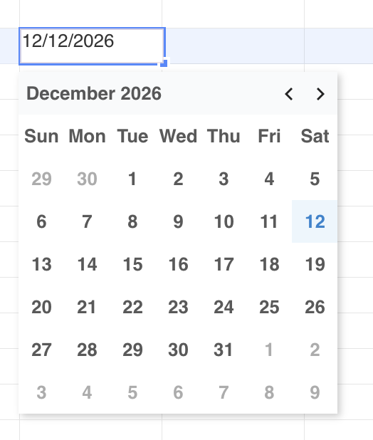
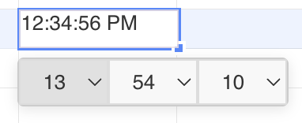

## Introduction

GridJs includes a `Datepicker` component and a `Timepicker` component inside the cell editor. The date picker wraps the `Calendar` component, and the time picker renders hour, minute, and second select controls.

The inspected editor shows these pickers when the active cell is recognized as date or time content. A picker can appear because the cell style format is `date` or `time`, because the current text is detected by `data.isDate(text)` or `data.isTime(text)`, because a custom number format is detected as date or time, or because the selected cell has a date or time validation rule.

## How to use

1. Select the cell or range that should use a date or time value.

2. To prepare a date cell, open the format dropdown and choose `Date`.

   The inspected format dropdown includes the `date` format with the visible title `Date`. When the toolbar change handler receives this format, GridJs applies the selected cell attribute with `data.setSelectedCellAttr('format', 'date')`.

3. Open the cell editor for the date-formatted cell.

   When the editor receives a cell whose style format is `date`, or whose text is detected as a date, GridJs shows the date picker. If the cell already contains non-empty text, the date picker tries to parse it and sets the calendar to that date.

4. Choose a day in the date picker.

   The calendar shows a month grid with previous and next month controls. When a day is selected, GridJs writes the selected value to the editor in `yyyy-mm-dd` format, returns focus to the editor, and hides the date picker.

5. To prepare a time cell, open the format dropdown and choose `Time`.

   The inspected format dropdown includes the `time` format with the visible title `Time`. When the toolbar change handler receives this format, GridJs applies the selected cell attribute with `data.setSelectedCellAttr('format', 'time')`.

6. Open the cell editor for the time-formatted cell.

   When the editor receives a cell whose style format is `time`, or whose text is detected as a time value, GridJs shows the time picker. If the cell already contains non-empty text, the time picker tries to parse it and sets the hour, minute, and second controls.

7. Change the hour, minute, or second select control.

   The time picker contains 24 hour options and 60 minute and second options. When a select value changes, GridJs calculates the selected time as a fraction of one day and writes that offset string to the editor.

8. Use data validation when the selected cells should be constrained to date or time values.

   Open `Data Validation` from the context menu, choose `Date` or `Time` in the `Allow` field, choose the comparison in the `Data` field, and enter the required date or time values. When a `Date` validation is saved, GridJs also sets the selected cell format to `date`. When a `Time` validation is saved, GridJs also sets the selected cell format to `time`.

## JavaScript API

The inspected code does not expose a declared public JavaScript method for opening the date picker or time picker directly. Picker behavior is wired into the internal editor, format handling, and data validation handling.

### Relevant functions
| Function / Location | Description | Parameters | Returns |
|----------|-------------|------------|---------|
| `baseFormats` (`core/format.js`) | Defines the `date` and `time` format entries used by the format dropdown. | None | Format entry array |
| `DropdownFormat` (`component/dropdown_format.js`) | Renders the format dropdown and sends `change("format", it.key)` when a format is selected. | `belongItem` | `Dropdown` instance |
| `toolbarChange(type, value)` (`component/sheet.js`) | Applies unhandled toolbar changes with `data.setSelectedCellAttr(type, value)`, including `format` changes from the dropdown. | `type`, `value`, optional `callback` | `void` |
| `ModalDataValidation.getSettingPage()` (`component/modal_data_validation.js`) | Adds `Date` and `Time` choices to the validation `Allow` dropdown. | None | Section component |
| `modalDataValidation.change(index, validation)` (`component/sheet.js`) | Saves the validation, maps `Date` and `Time` validation to `validator.type`, and sets selected cell format to `date` or `time`. | `index`, `validation` | `void` |
| `Editor.setCell(cell, validator, data, focus)` (`component/editor.js`) | Shows the date picker or time picker when style, text, custom format, or validator type matches date or time. | `cell`, `validator`, `data`, optional `focus` | `Promise<void>` |
| `Datepicker.setValue(date, fromInputEl)` (`component/datepicker.js`) | Parses a `Date` object or non-empty string and updates the calendar value when the result is valid. | `date`, optional `fromInputEl` | `Datepicker` instance |
| `Datepicker.change(cb)` (`component/datepicker.js`) | Connects calendar selection to an editor callback, focuses the source input, and hides the picker. | `cb` | `void` |
| `Calendar.prev()` and `Calendar.next()` (`component/calendar.js`) | Move the calendar display by one month and rebuild the calendar UI. | None | `void` |
| `Timepicker.setValue(timeString, fromInputEl)` (`component/timepick.js`) | Parses a time string, updates hour, minute, and second select values, and hides seconds when the input has only hour and minute parts. | `timeString`, optional `fromInputEl` | `Timepicker` instance |
| `Timepicker.change(cb)` (`component/timepick.js`) | Builds an `HH:mm:ss` value internally, converts it to a fraction of one day, and passes that offset string to the callback. | `cb` | `void` |

## Common Questions

Q: When does the date picker appear?
A: The inspected editor shows it when the style format is `date`, when `data.isDate(text)` returns true, when a custom format is detected as a date format, or when the validator type is `date`.

Q: When does the time picker appear?
A: The inspected editor shows it when the style format is `time`, when `data.isTime(text)` returns true, when a custom format is detected as a time format, or when the validator type is `time`.

Q: What date text does the date picker write to the editor?
A: The editor formats the selected `Date` as `yyyy-mm-dd`.

Q: Does the time picker write `HH:mm:ss` directly to the editor?
A: No. The inspected `Timepicker.change` builds `HH:mm:ss` internally, converts it to a fraction of one day, and passes that offset string to the editor.
