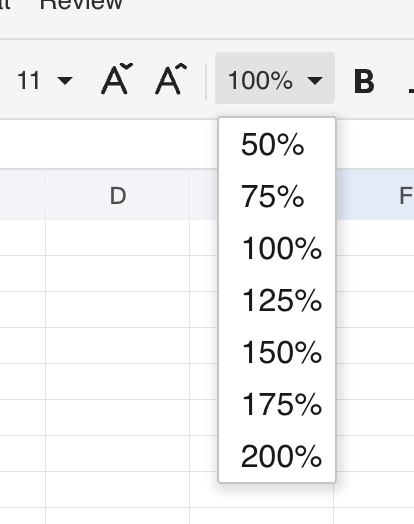

## Introduction

GridJs provides a toolbar item with tag `zoom-size` and label **Zoom**. The dropdown contains seven preset levels: `50%`, `75%`, `100%`, `125%`, `150%`, `175%`, and `200%`. Selecting one preset sends the selected object (for example `{ text: "150%", number: 1.5 }`) through the toolbar change pipeline and calls `sheet.setzoom(value.number)`. On touch devices, GridJs also handles pinch gestures and clamps pinch zoom to the range `0.5` to `2` before calling `setzoom`.

## How to use

1. Open GridJs and locate the **Zoom** control in the toolbar.



2. Click the Zoom dropdown and select one preset value from `50%`, `75%`, `100%`, `125%`, `150%`, `175%`, or `200%`.

3. After selection, GridJs routes the toolbar event as `type === 'zoom-size'` and applies `this.setzoom(value.number)`.

4. If you are using a touch device, use a pinch gesture on the sheet area. GridJs reads `evt.zoom`, clamps values above `2` down to `2`, clamps values below `0.5` up to `0.5`, and then applies `setzoom`.

5. In protected-sheet mode, zoom is still allowed because `zoom-size` is included in `protectSheetAllowOperations`.

## JavaScript API

```js
const xs = x_spreadsheet('#gridjs-demo-uid', options);

// Programmatically apply zoom.
xs.setZoomLevel(1.25);

// You can also restore normal scale.
xs.setZoomLevel(1);
```

### Relevant functions
| Function | Description | Parameters | Returns |
|----------|-------------|------------|---------|
| `setZoomLevel(v)` | Public Spreadsheet method that forwards zoom changes to `sheet.setzoom(v)`. | `v`: zoom factor (for example `0.5`, `1`, `1.25`, `2`) | `void` |
| `sheet.setzoom(v)` | Applies zoom to table/data state, updates overlay sizing for zoom `< 1` on non-mobile, calls canvas zoom, re-renders via `sheetReset`, and updates conditional-image zoom. | `v`: zoom factor | `void` |
| `pinch(evt)` | Touch gesture handler that clamps `evt.zoom` into `[0.5, 2]` before calling `setzoom`. | `evt.zoom`: gesture zoom factor | `void` |

The inspected `index.d.ts` file in this repository does not declare `setZoomLevel`, but the `index.js` implementation exposes and uses this method directly.

## Common Questions

Q: What zoom presets are available in the toolbar?
A: The dropdown defines exactly seven presets: `50%`, `75%`, `100%`, `125%`, `150%`, `175%`, and `200%`.

Q: What is the default zoom level when data is initialized?
A: `DataProxy` initializes `zoomlevel` to `1`.

Q: Does pinch zoom have limits?
A: Yes. The pinch handler clamps zoom values to a minimum of `0.5` and a maximum of `2`.

Q: Is zoom blocked when the sheet is protected?
A: No. `zoom-size` is explicitly included in the allowed operations list for protected sheets.
