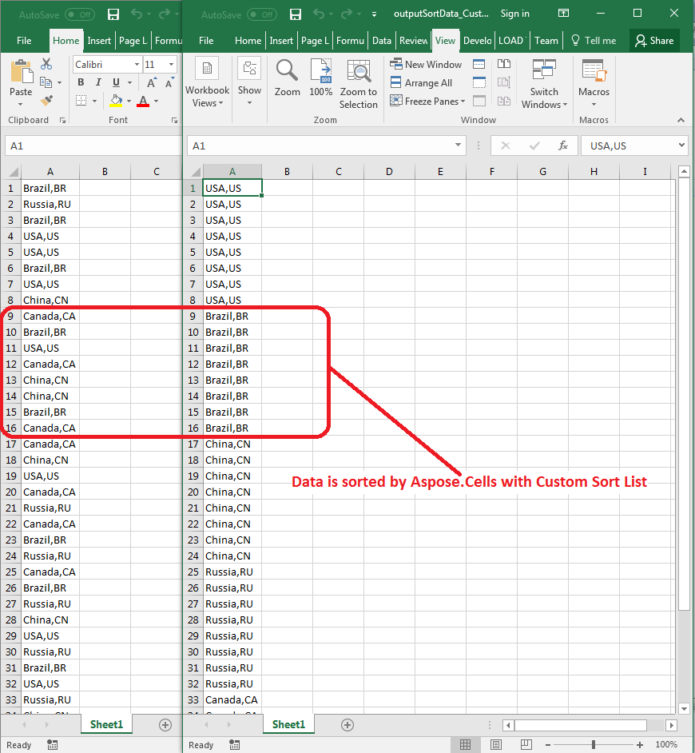

## **Possible Usage Scenarios**

You can sort data in a column using a custom list. This can be done using the **DataSorter.add_key(key, order, custom_list)** method. However, this method works only if the items in the custom list do not contain commas. If they contain commas, such as `"USA,US"` or `"China,CN"`, you must use the overload of **DataSorter.add_key** that accepts an array of strings. In this overload, the last parameter is not a string but an array of strings.

## **Sort Data in Column with Custom Sort List**

The following sample code demonstrates how to use the **DataSorter.add_key(key, order, custom_list)** method to sort data with a custom sort list. Please see the [sample Excel file](50528327.xlsx) used in this code and the [output Excel file](50528328.xlsx) generated by it. The following screenshot shows the effect of the code on the sample Excel file when executed.

## **Sample Code**



