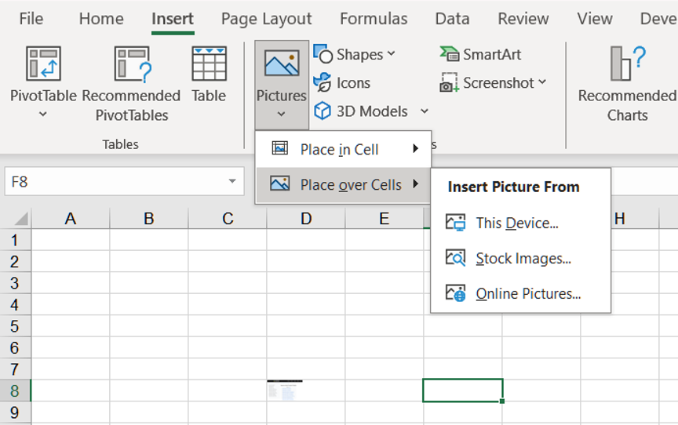
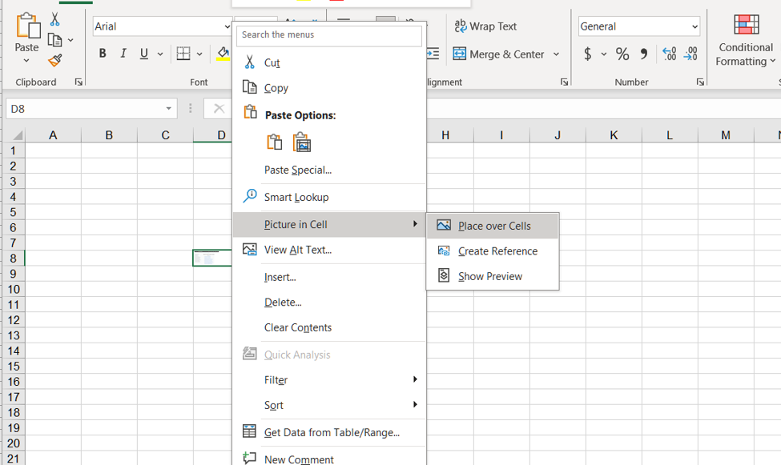
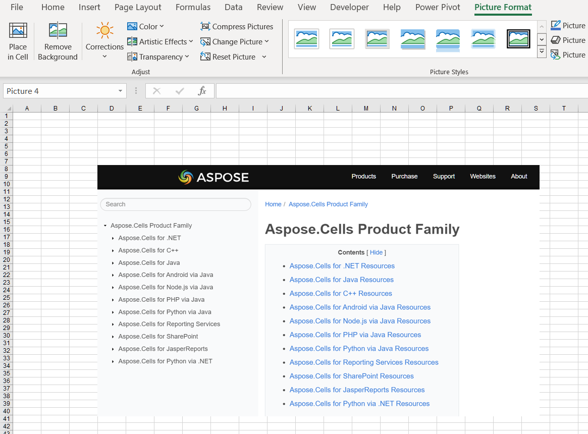
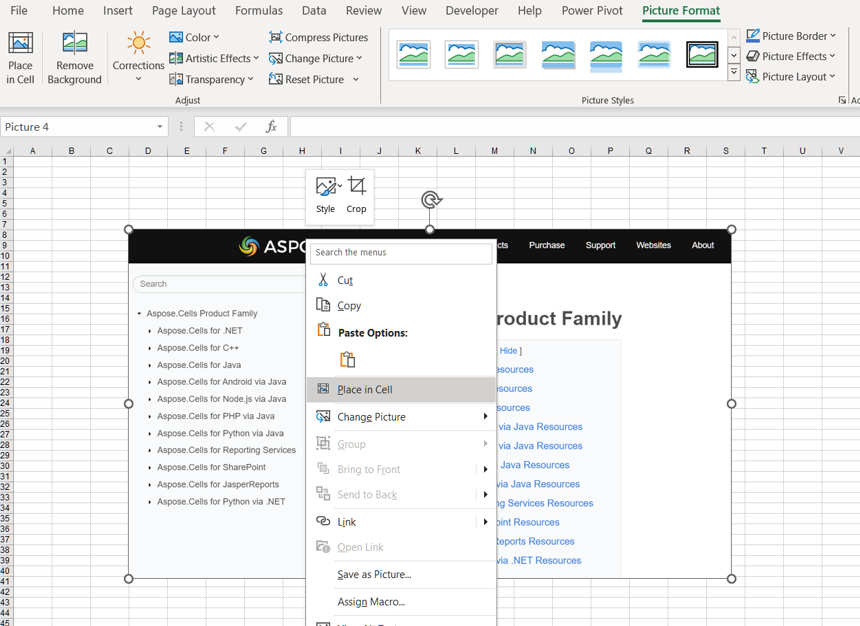
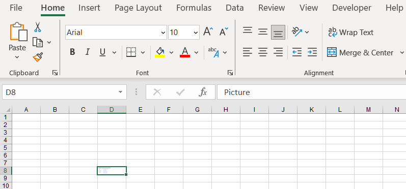

## **Possible Usage Scenarios**
The image adds a touch of brightness to your worksheet and provides a visual representation of the content. It also makes it easier for you to understand the data and derive insights. Although you have been able to use images in Excel for many years, Excel has only recently enabled the feature of images becoming actual cell values. Even if the layout of the drawing is modified, it will still be attached to the data. You can use it in tables, sort, filter, include it in formulas, and so on!

## **How to Insert Picture in Cell Using Excel**
About how to insert a picture into a cell in Excel, follow these steps:

1. Go to the **Insert** tab and click on the **Pictures** option.  
2. Select **Place in Cell**. Then select one of the following sources from the **Insert Picture From** dropdown menu (**This Device**, **Stock Images**, and **Online Pictures**). **This Device** inserts a picture from your device. **Stock Images** inserts a picture from the stock collection. **Online Pictures** inserts a picture from the web.  
    
   
3. Select the picture and insert it into a cell.  
    
   

## **How to Insert Picture over Cells Using Excel**
About how to insert a picture over cells in Excel, follow these steps:

1. Go to the **Insert** tab and click on the **Pictures** option.  
2. Select **Place over Cells**. Then select one of the following sources from the **Insert Picture From** dropdown menu (**This Device**, **Stock Images**, and **Online Pictures**). **This Device** inserts a picture from your device. **Stock Images** inserts a picture from the stock collection. **Online Pictures** inserts a picture from the web.  
    
   
3. Select the picture and insert it over cells.  
    
   

## **How to Switch from Picture in Cell to Picture over Cells Using Excel**
You can easily switch from **Picture in Cell** to **Picture over Cells**. Please follow these steps:

1. Right‑click on the cell and select **Picture in Cell** > **Place over Cells**.  
    
   
2. The result after switching is as follows:  
    
   

## **How to Switch from Picture over Cells to Picture in Cell Using Excel**
You can easily switch from **Picture over Cells** to **Picture in Cell**. Please follow these steps:

1. Right‑click on the picture and select **Place in Cell**.  
    
   
2. The result after switching is as follows:  
    
   

## **How to Insert Picture in Cell Using Aspose.Cells for Python Excel Library**
Insert a picture in a cell using Aspose.Cells for Python via .NET. Please see the following sample code. After executing the example code, a picture will be inserted into a cell.

1. Instantiate a [**Workbook**](https://reference.aspose.com/cells/python-net/aspose.cells/workbook) object.  
2. Get the cell where you want to insert the picture.  
3. Set the **Cell.EmbeddedImage** property.  
4. Finally, save the workbook in the [output XLSX](out.xlsx) format.  

## **Sample Code**



