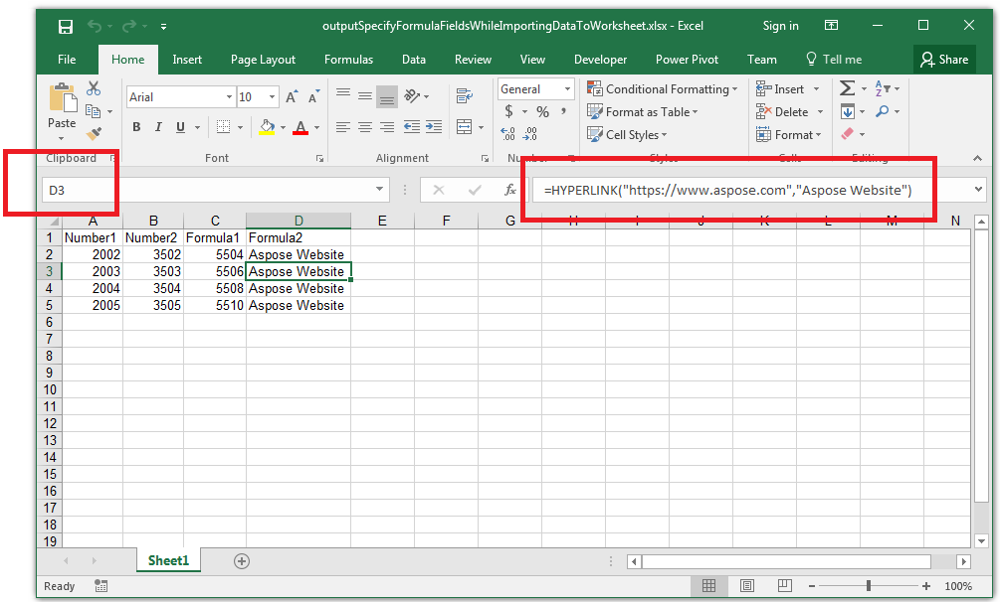

## **Possible Usage Scenarios**

You can specify formula fields when importing data into your worksheet using the [**ImportTableOptions.is_formulas**](https://reference.aspose.com/cells/python-net/aspose.cells/importtableoptions/is_formulas/) property. This property takes a boolean list where the value **True** indicates the field is a formula. For example, if the third field is a formula field, the third element in the list will be **True**.

## **Specify Formula Fields during Data Import**

The following example demonstrates how to specify formula fields while importing data. See the generated [output Excel file](61767838.xlsx) and screenshot showing the results.



## **Sample Code**

```python
import os
from dataclasses import dataclass
from aspose.cells import Workbook, ImportTableOptions

# For complete examples and data files, please go to https://github.com/aspose-cells/Aspose.Cells-for-.NET

@dataclass
class DataItems:
    number1: int
    number2: int
    formula1: str
    formula2: str

def run():
    output_dir = os.path.join(os.path.dirname(os.path.abspath(__file__)), "output")
    os.makedirs(output_dir, exist_ok=True)

    dis = []
    dis.append(DataItems(2002, 3502, "=SUM(A2,B2)", "=HYPERLINK(\"https://www.aspose.com\",\"Aspose Website\")"))
    dis.append(DataItems(2003, 3503, "=SUM(A3,B3)", "=HYPERLINK(\"https://www.aspose.com\",\"Aspose Website\")"))
    dis.append(DataItems(2004, 3504, "=SUM(A4,B4)", "=HYPERLINK(\"https://www.aspose.com\",\"Aspose Website\")"))
    dis.append(DataItems(2005, 3505, "=SUM(A5,B5)", "=HYPERLINK(\"https://www.aspose.com\",\"Aspose Website\")"))

    wb = Workbook()
    ws = wb.worksheets[0]

    opts = ImportTableOptions()
    opts.is_formulas = [False, False, True, True]

    ws.cells.import_custom_objects(dis, 0, 0, opts)

    wb.calculate_formula()
    ws.auto_fit_columns()

    output_path = os.path.join(output_dir, "outputSpecifyFormulaFieldsWhileImportingDataToWorksheet.xlsx")
    wb.save(output_path)

    print("SpecifyFormulaFieldsWhileImportingDataToWorksheet executed successfully.")

if __name__ == "__main__":
    run()
```

