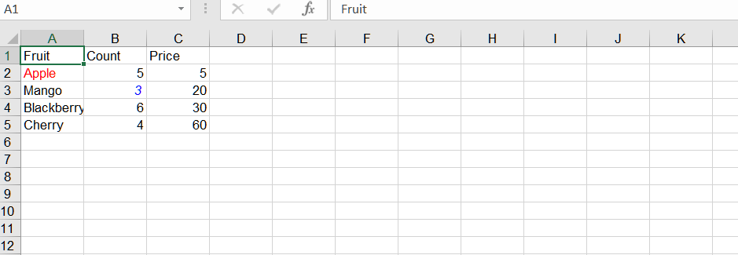

## **Possible Usage Scenarios**
When you want to highlight certain data, you can change the style of the cells.

## **How to change the format of a cell in Excel**

To change the format of a single cell in Excel, follow these steps:

1. Open Excel and the workbook that contains the cell you want to format.

2. Locate the cell you want to format.

3. Right‑click on the cell and select "Format Cells" from the context menu. Alternatively, you can select the cell and go to the Home tab in the Excel ribbon, click on the "Format" dropdown in the "Cells" group, and select "Format Cells".

4. The "Format Cells" dialog box will appear. Here, you can choose various formatting options to apply to the selected cell. For example, you can change the font style, font size, font color, number format, borders, background color, etc. Explore the different tabs in the dialog box to access various formatting options.

5. After making the desired formatting changes, click the "OK" button to apply the formatting to the selected cell.

## **How to change the format of a cell Using Python via .NET**

To change the format of a cell using Aspose.Cells for Python via .NET, you can use the following methods:
1. [Cell.set_style(style)](https://reference.aspose.com/cells/python-net/aspose.cells/cell/set_style/#aspose.cells.Style)
2. [Cell.set_style(style, explicit_flag)](https://reference.aspose.com/cells/python-net/aspose.cells/cell/set_style/#aspose.cells.Style-bool)
3. [Cell.set_style(style, flag)](https://reference.aspose.com/cells/python-net/aspose.cells/cell/set_style/#aspose.cells.Style-aspose.cells.StyleFlag)

## **Sample Code**
In this example, we create an Excel workbook, add some sample data, access the first worksheet, and get two cells ("A2" and "B3"). Then, we get the styles of the cells, set various formatting options (e.g., font color, bold), and apply the format to the cells. Finally, we save the workbook to a new file.




